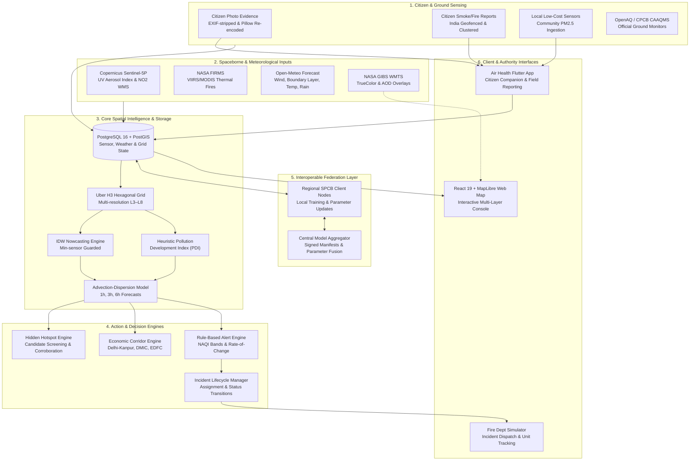

# Air Health — Federated Climate Action & Pollution Intelligence

[](https://github.com/Hima-11-works/gdg-c4c/actions/workflows/pipeline.yml)


An AI-powered, federated climate action platform designed for Indian cities, states, and citizens. It bridges the critical divide between sparse macro-level monitoring and hyper-local pollution events by fusing **citizen science (photos, local sensor readings)** with **satellite observations (Copernicus Sentinel-5P, NASA FIRMS)** and **high-resolution meteorology**. Featuring multi-horizon air quality forecasting along key economic corridors, automated hidden hotspot detection, an operational incident dispatch workflow for rapid intervention, and a federated machine learning architecture for privacy-preserving inter-agency collaboration.

Built for Google's **Code for Communities (GDG C4C)** Hackathon.

---

## 🎯 The Hackathon Problem & Challenge

### The Problem
> **Macro vs Hyper-Local Blindspots in Indian Air Quality**  
> Major Indian cities monitor macro-level air quality through a limited network of continuous ambient air quality monitoring stations (CAAQMS). However, they consistently miss hyper-local, high-consequence pollution events — unmonitored industrial emissions, large-scale agricultural stubble burning across Punjab, Haryana, and Western UP, brick kiln clusters, and sudden seasonal smog episodes. The absence of real-time, granular spatial data prevents coordinated, cross-jurisdictional climate action and directly threatens public health.

### The Challenge
> **An AI-Powered, Federated Climate Action Platform**  
> Build an interoperable climate action platform that combines citizen-sourced data (geotagged photos, local low-cost sensor readings) with satellite imagery and meteorological data. It must detect hidden pollution hotspots, forecast air quality spikes across major economic corridors, and alert relevant authorities for rapid intervention — designed for interoperability so Indian cities and states can share predictive models and coordinate emergency resources.

### 💡 How This Platform Solves the Challenge

| Challenge Requirement | How Our Platform Implements It | Shipped Artifacts & Systems |
|---|---|---|
| **Citizen-Sourced Ground Truth** | Mobile-first citizen reporting with privacy-preserving EXIF-stripped photo evidence, real-time smoke/fire submissions, user sensitivity health profiles (asthma, elderly, pediatric, cardiac), and local low-cost PM2.5 sensor integration. | Flutter Mobile App ([`air_health_flutter`](partner_apps/air_health_flutter/)), Photo Evidence API ([`docs/api/citizen-photos.md`](docs/api/citizen-photos.md)), Community Sensor API ([`docs/api/citizen-sensor-readings.md`](docs/api/citizen-sensor-readings.md)) |
| **Satellite & Meteorological Ingestion** | Automated ingestion of Copernicus Sentinel-5P UV Aerosol Index (UVAI), NASA FIRMS VIIRS active fire anomalies, OpenAQ CAAQMS stations, and Open-Meteo weather parameters (wind vectors, boundary layer, precipitation). | Ingestion Pipeline (`app.ingestion`), Source Inventory ([`ENVIRONMENTAL_SOURCE_INVENTORY.md`](docs/ENVIRONMENTAL_SOURCE_INVENTORY.md)) |
| **Hidden Hotspot Detection** | Autonomous hotspot candidate generation flagging unmonitored emission surges by correlating satellite aerosol anomalies with citizen smoke reports and local sensor spikes. | Hotspot Service (`app.services.hotspot_detection`), Hotspot Review Workflow ([`docs/api/hotspots.md`](docs/api/hotspots.md)) |
| **Economic Corridor Forecasting** | Spatio-temporal exposure modeling along major Indian freight and transit corridors to predict air quality spikes and identify lower-exposure transit windows, with strictly honest evaluation against withheld stations. | Delhi–Kanpur Interstate Corridor, DMIC (Delhi-Mumbai), EDFC Freight Axis ([`docs/api/corridor-evaluation.md`](docs/api/corridor-evaluation.md)) |
| **Rapid Authority Intervention** | Automated alert generation with incident lifecycle management (`REPORTED` → `ACKNOWLEDGED` → `EN ROUTE` → `ON SCENE` → `RESOLVED`) connected to an operational incident response console. | Incident Engine (`app.services.incidents`), Fire & Authority Response Simulator ([`fire_dept_simulator`](partner_apps/fire_dept_simulator/)), Incident API Contract ([`docs/api/incidents.md`](docs/api/incidents.md)) |
| **Interoperable Federation** | Decentralized, multi-client/aggregator architecture allowing municipal corporations and state pollution control boards (SPCBs) to train local models and exchange signed parameter updates without sharing raw citizen or proprietary sensor data. | Federation Aggregator & Client CLI (`app.federation_*`), Federation Protocol ([`docs/api/federation.md`](docs/api/federation.md)) |

---

## 📑 Contents

- [System Architecture](#system-architecture)
- [Subsystem Documentation](#-subsystem-documentation)
- [Key Platform Pillars](#key-platform-pillars)
- [Granular Spatial Grid & Map](#granular-spatial-grid--map)
- [Environmental Data Sources](#environmental-data-sources)
- [Partner Mobile Apps & Ready-to-Install APKs](#partner-mobile-apps--ready-to-install-apks)
- [Quick Start](#quick-start)
- [Live Pipeline & Scheduled Ingestion](#live-pipeline--scheduled-ingestion)
- [CLI Tooling & Operational Commands](#cli-tooling--operational-commands)
- [Federation & Inter-Agency Workflows](#federation--inter-agency-workflows)
- [API Index & Contracts](#api-index--contracts)
- [Google Stack Integration Roadmap](#google-stack-integration-roadmap)
- [Development & Testing](#development--testing)
- [Limits & Operational Roadmap](#limits--operational-roadmap)
- [Repository Guide](#repository-guide)

---

## 📚 Subsystem Documentation

For in-depth component-level guides, architectural deep-dives, and setup instructions, refer to the dedicated READMEs:

| Subsystem | Stack | Description | Dedicated Guide |
|---|---|---|:---:|
| 📊 **Hackathon Pitch Deck** | 12-Slide Deck · Speaker Script · Rubric Map | Official 10–12 slide presentation deck, visual diagrams, and speaker notes | [**Pitch Deck Guide**](docs/PITCH_DECK.md) |
| 🖥️ **Web Dashboard** | React 19 · TypeScript · MapLibre GL · Tailwind | Dynamic H3 multi-resolution spatial explorer, corridor routing, and hotspot inspection | [**Frontend Guide**](frontend/README.md) |
| ⚙️ **Backend Core & Pipeline** | FastAPI · PostgreSQL/PostGIS · Uber H3 · Python 3.11+ | Spatial nowcasting, advection-dispersion forecasting, satellite fusion, and REST API | [**Backend Guide**](backend/README.md) |
| 📱 **Air Health Citizen App** | Flutter · Riverpod · Clean Architecture | Personal exposure tracking, sensitivity health profiles, offline reverse-geocoding, and reports | [**Air Health App Guide**](partner_apps/air_health_flutter/README.md) |
| 🚒 **Fire Dept Simulator** | Flutter · Zero-External-Pub · Native `dart:io` | Operational dispatch console for emergency responders and pollution control boards | [**Fire Dept Console Guide**](partner_apps/fire_dept_simulator/README.md) |

---

## 🏛️ System Architecture



---

## 🚀 Key Platform Pillars

### 1. 🔍 Hidden Hotspot Detection (Satellite + Citizen Corroboration)
Traditional monitoring misses rural stubble burning and industrial bypass events between macro stations. The platform continuously ingests **Copernicus Sentinel-5P UV Aerosol Index (UVAI)** swaths. When aerosol anomalies are detected, the system generates **Hotspot Candidates** and attempts cross-verification with:
- **NASA FIRMS** satellite thermal fire pixels (VIIRS / MODIS).
- **Citizen-reported** smoke plumes and geotagged field photos.
- **Local sensor** reading spikes in downwind H3 cells.
Candidates are ranked with confidence metrics and routed to authorities for human field verification rather than generating automated false alarms.

### 2. 🚚 Economic Corridor Forecasting & Exposure Routing
Major industrial and freight corridors in Northern and Western India (such as the Indo-Gangetic Plain and freight corridors) concentrate heavy vehicular emissions and experience severe winter smog trapping. The platform provides:
- **Delhi–Kanpur Interstate Corridor** (Indo-Gangetic Plain agricultural and industrial axis).
- **DMIC** (Delhi–Mumbai Industrial Corridor connecting NCR, Rajasthan, Gujarat, and Maharashtra).
- **EDFC** (Eastern Dedicated Freight Corridor from Sahnewal/Ludhiana to Dankuni/Kolkata).
Evaluates forward 1h, 3h, and 6h exposure profiles along corridor cells, enabling logistics coordinators to schedule transit windows during lower-exposure conditions. Forecast accuracy is strictly scored against withheld station data without ever claiming synthetic numbers as true performance.

### 3. 📱 Citizen Science & Ground Truth (Flutter Companion App)
Citizens are equipped with the **`air_health_flutter`** mobile app:
- **Personalized Health Profiles**: Tailored health advisories based on sensitivity profiles (**Asthma**, **Elderly**, **Pediatric/Children**, **Cardiac/Heart Conditions**).
- **Dual-Tier Alerting**: Real-time CPCB NAQI community notifications paired with individualized medical vulnerability alerts.
- **Audio Sound Alerts**: Optional audible chime alert engine for critical spikes.
- **Human-Readable Nearby Safe Havens**: Replaces raw truncated H3 hexagonal IDs with human-readable location names and compass bearings backed by an offline geocoded dataset of **over 10,600 Indian localities and cities** (`assets/data/india_locations.json`) with instant embedded offline seeds.
- **Ground-Truth Field Reporting**: Citizens can capture smoke and fire incidents. The app automatically sanitizes uploads by **stripping sensitive EXIF metadata** before transmission.
- **Low-Cost Sensor Submissions**: Citizens and community organizations can pipe micro-sensor PM2.5 data directly into the regional grid for authority review.
- **Offline Resilience**: Local report history and profile persistence backed by secure on-device storage.

### 4. 🚨 Rapid Authority Intervention (Incident Response Console)
When alert thresholds are breached or citizen reports are corroborated:
- Incidents are automatically instantiated with geographic coordinates, H3 cell indices, and priority levels.
- The **`fire_dept_simulator`** Flutter operational console allows municipal authorities and fire departments to receive dispatch requests, view attached evidence photos, and track real-time status transitions:
  `REPORTED` ➔ `ACKNOWLEDGED` ➔ `EN ROUTE` ➔ `ON SCENE` ➔ `RESOLVED`
- **Zero-Dependency Native Architecture**: Built completely on Dart's native standard library (`dart:io`) with zero third-party pub dependencies, dedicated emergency response branding, and built-in live connection diagnostics.
- Audit events are appended immutably to trace who acted, when, and from which jurisdiction.

### 5. 🤝 Federated Climate Intelligence Across States & Cities
Air pollution does not stop at administrative boundaries. The platform features an **interoperable federated learning architecture**:
- **Decentralized State/City Nodes**: Each regional authority (e.g., DPCC in Delhi, PPCB in Punjab, UPPCB in Uttar Pradesh) retains complete ownership of its local ground sensor data and citizen reports.
- **Signed Parameter Updates**: Regional client nodes train localized ridge-residual calibration models and exchange cryptographic model updates over HTTP with an aggregator node.
- **Privacy-Preserving**: Raw sensor measurements and citizen identities never leave the local node's perimeter.

---

## 🗺️ Granular Spatial Grid & Map

The web application uses the **Uber H3 Discrete Global Grid System** to discretize spatial pollution fields. As users explore, the viewport dynamically adapts its H3 resolution:

| Map Level | Viewport Zoom | H3 Resolution | Hex Cell Diameter | Requested Coverage |
|:---:|:---:|:---:|:---:|---|
| **Level 1** | `< 6` | **H3 Res 3** | ~110 km | National India overview (aggregated OpenAQ stations) |
| **Level 2** | `6 to < 7` | **H3 Res 4** | ~41 km | Dynamic viewport boundary |
| **Level 3** | `7 to < 9` | **H3 Res 5** | ~16 km | State-level focus & major industrial corridors |
| **Level 4** | `9 to < 10.5` | **H3 Res 6** | ~6 km | District / Municipal Corporation view |
| **Level 5** | `10.5 to 12` | **H3 Res 7** | ~2.2 km | Hyper-local ward & neighborhood analysis |

- **Layer Controls**: Toggle between discrete H3 hexagons and continuous IDW-interpolated heat surfaces.
- **Overlays**: Real-time wind vector particle trails, active NASA FIRMS thermal detections, citizen photo markers, active incidents, and NASA GIBS satellite raster overlays (True Color / Aerosol Optical Depth).

---

## 📊 Environmental Data Sources

| Source | Role in Platform | Provenance & Access |
|---|---|---|
| [**OpenAQ**](https://openaq.org/) | Ground-level CAAQMS PM2.5 observations | Official CPCB & SPCB monitoring stations (API key configured) |
| [**Open-Meteo**](https://open-meteo.com/) | High-resolution meteorological data | Wind speed/direction, temperature, precipitation, boundary layer height |
| [**Copernicus CDSE**](https://dataspace.copernicus.eu/) | Sentinel-5P UV Aerosol Index (UVAI) & NO2 | Screening for elevated smoke and industrial plumes |
| [**NASA FIRMS**](https://firms.modaps.eosdis.nasa.gov/) | VIIRS / MODIS satellite fire anomalies | Rapid corroboration of agricultural stubble burning and industrial flares |
| [**NASA GIBS**](https://wiki.earthdata.nasa.gov/display/GIBS) | Real-time true-color & AOD imagery | Visual satellite confirmation overlays via backend proxy |
| [**geoBoundaries**](https://www.geoboundaries.org/) | Administrative boundary hierarchies | Official India State and District boundaries (ODC-ODbL) |
| [**GeoNames**](https://www.geonames.org/) | Geographic gazetteer | Fast location search across Indian towns and cities (CC BY 4.0) |

*Full licensing, retention, and fallbacks are documented in [`docs/ENVIRONMENTAL_SOURCE_INVENTORY.md`](docs/ENVIRONMENTAL_SOURCE_INVENTORY.md).*

---

## 📱 Partner Mobile Apps & Ready-to-Install APKs

Pre-built release APKs are available directly in [`apks/`](apks/) for immediate testing on Android devices:

| Mobile Application | Description | Architecture | Download Link |
|---|---|---|---|
| **Air Health Companion** | Citizen air quality tracker, sensitivity health profiles (asthma, elderly, cardiac, children), audio alarms, photo & sensor reporting | **ARM 64-bit** (Modern Phones)<br/>**ARM 32-bit**<br/>Universal Fat APK | [Download ARM64](apks/air_health_flutter-arm64.apk)<br/>[Download ARM32](apks/air_health_flutter-arm32.apk)<br/>[Download Universal](apks/air_health_flutter-release.apk) |
| **Fire Dept Simulator** | Incident response console for fire and pollution control authorities with photo evidence inspection | **ARM 64-bit** (Modern Phones)<br/>**ARM 32-bit**<br/>Universal Fat APK | [Download ARM64](apks/fire_dept_simulator-arm64.apk)<br/>[Download ARM32](apks/fire_dept_simulator-arm32.apk)<br/>[Download Universal](apks/fire_dept_simulator-release.apk) |

### Installing via ADB:
```bash
# Install the citizen companion app
adb install apks/air_health_flutter-arm64.apk

# Install the fire department response console
adb install apks/fire_dept_simulator-arm64.apk
```

---

## ⚡ Quick Start

### Prerequisites
- **Docker Desktop** (with Compose v2)
- **Node.js** (`^20.19.0` or `>=22.12.0`)
- **Python** `3.11+` (optional for local non-Docker development)
- **Git**

### Step-by-Step Local Deployment

1. **Clone the repository:**
   ```bash
   git clone https://github.com/Hima-11-works/gdg-c4c.git
   cd gdg-c4c
   ```

2. **Set up environment configurations:**
   ```powershell
   Copy-Item .env.example .env
   Copy-Item frontend/.env.example frontend/.env
   ```
   *Note: `.env.example` comes pre-configured with `DEMO_MODE=true` so you can evaluate the entire pipeline immediately without needing external API keys.*

3. **Start PostgreSQL + PostGIS and FastAPI Backend:**
   ```bash
   docker compose up --build -d
   ```
   *The backend applies database migrations automatically on startup.*

4. **Populate demo data and trigger initial pipeline:**
   ```bash
   docker compose exec api python -m app.pipeline.run
   ```

5. **Start the React + MapLibre Web Map:**
   ```bash
   cd frontend
   npm ci
   npm run dev
   ```

6. **Access the Interfaces:**
   - 🌐 **Web Map Explorer**: [http://localhost:5173](http://localhost:5173)
   - 📖 **Interactive API Documentation (Swagger)**: [http://localhost:8000/docs](http://localhost:8000/docs)
   - 🩺 **Health Check**: [http://localhost:8000/health/ready](http://localhost:8000/health/ready)

---

## 🔄 Live Pipeline & Scheduled Ingestion

To feed the system with real-time live satellite and ground data, populate the following credentials in your root `.env`:

```env
DEMO_MODE=false
OPENAQ_API_KEY=your_openaq_api_key
CDSE_REFRESH_TOKEN=your_copernicus_data_space_token
FIRMS_MAP_KEY=your_nasa_firms_map_key
INGEST_BBOX_MIN_LAT=28.40
INGEST_BBOX_MIN_LON=76.80
INGEST_BBOX_MAX_LAT=28.90
INGEST_BBOX_MAX_LON=77.50
```

- **Hourly Automation**: An automated workflow in [`.github/workflows/pipeline.yml`](.github/workflows/pipeline.yml) triggers hourly ingestion, updating H3 grid states, advection forecasts, and alert registries.
- **Manual Pipeline Trigger**:
  ```bash
  docker compose exec api python -m app.pipeline.run
  ```

---

## 🛠️ CLI Tooling & Operational Commands

The backend includes a feature-rich CLI for operations, evaluations, and data management:

| Command | Description | Example Usage |
|---|---|---|
| `python -m app.pipeline.run` | Run the complete multi-stage pipeline end-to-end | `python -m app.pipeline.run` |
| `python -m app.cli ingest` | Ingest CAAQMS PM2.5 station observations | `python -m app.cli ingest` |
| `python -m app.cli ingest-weather` | Ingest Open-Meteo weather features across H3 | `python -m app.cli ingest-weather` |
| `python -m app.cli ingest-fires` | Ingest NASA FIRMS VIIRS fire anomalies | `python -m app.cli ingest-fires --days 1` |
| `python -m app.cli forecast` | Run the Deterministic H3 Advection-Dispersion model | `python -m app.cli forecast` |
| `python -m app.cli hotspot-scan` | Run candidate-hotspot detector over case fixtures | `python -m app.cli hotspot-scan --fixture tests/fixtures/hotspots/positive_hotspot.json` |
| `python -m app.cli corridor-evaluate` | Score corridor forecast against real withheld stations | `python -m app.cli corridor-evaluate --corridor delhi-kanpur` |
| `python -m app.cli verify-media-storage` | Test and verify citizen photo evidence store | `python -m app.cli verify-media-storage --sweep-expired` |
| `python -m app.cli expire-reports` | Sweep and persist expired status for citizen reports | `python -m app.cli expire-reports` |
| `python -m app.cli federation-demo` | Run local multi-party federated model demo | `python -m app.cli federation-demo` |

---

## 🌐 Federation & Inter-Agency Workflows

The platform supports cross-jurisdictional collaboration through governed, privacy-preserving federated model updates:

### Two-Partition Local Demo
Simulates two distinct regional authorities training local models and aggregating them:
```bash
# In backend environment:
python -m app.cli federation-demo
```
Inspect public status:
```bash
curl http://localhost:8000/api/v1/federation/status
```

### Multi-Process Client/Aggregator Workflow
Run an independent aggregator and two separate regional client processes:
```powershell
# 1. Start central model aggregator:
python -m app.federation_aggregator --port 8010 --run-id fed-run-01 --client-keys var/federation/client_keys.json

# 2. Start Regional Client A (e.g., Delhi NCR node):
python -m app.federation_client --participant region-a --aggregator-url http://localhost:8010

# 3. Start Regional Client B (e.g., Punjab / Haryana node):
python -m app.federation_client --participant region-b --aggregator-url http://localhost:8010
```
*Full protocol specification in [`docs/api/federation.md`](docs/api/federation.md).*

---

## 🔌 API Index & Contracts

### Prediction & Environmental Grid APIs (v2)

| Method & Route | Description | Contract & Notes |
|---|---|---|
| `GET /api/v2/grid/current` | Active H3 grid cells with nowcasted PM2.5, PDI, confidence, and bounds | [Architecture Specification](docs/architecture.md) |
| `GET /api/v2/grid/forecast` | Advection-dispersion forecast fields (1h, 3h, 6h horizons) | [Architecture Specification](docs/architecture.md) |
| `GET /api/v2/cells/{h3_cell}` | Cell detail view: time series, weather features, land-use, and population exposure | [Architecture Specification](docs/architecture.md) |
| `GET /api/v2/weather` | Weather grid across H3 cells (wind u/v, boundary layer height, temperature, humidity) | [Architecture Specification](docs/architecture.md) |
| `GET /api/v2/alerts` | Published warning/critical alerts classified by NAQI bands | [Architecture Specification](docs/architecture.md) |
| `GET /api/v2/exposure` | Population-weighted PM2.5 exposure and high-risk headcount metrics | [Architecture Specification](docs/architecture.md) |
| `GET /api/v2/meta` | Published run metadata, native resolution, data mode, and upstream source health | [Architecture Specification](docs/architecture.md) |

### Hotspots & Corridors (v1)

| Method & Route | Description | Contract & Notes |
|---|---|---|
| `GET /api/v1/hotspots` | Satellite UVAI + FIRMS hotspot candidates awaiting review | [Hotspots Contract](docs/api/hotspots.md) |
| `GET /api/v1/corridors` | List named economic corridors (`delhi-kanpur`, `dmic`, `edfc`) | [Corridor Contract](docs/api/corridor-evaluation.md) |
| `GET /api/v1/corridors/{id}/evaluation` | Freight corridor exposure analysis & honest station validation | [Corridor Contract](docs/api/corridor-evaluation.md) |

### Citizen Science, Photos & Sensors

| Method & Route | Description | Contract & Notes |
|---|---|---|
| `POST /api/v1/reports` | Submit citizen smoke/fire report (India geofenced, auto-clustered) | [Reports Contract](docs/api/citizen-reports.md) |
| `GET /api/v1/reports/{id}` | Read individual report standing and lifecycle status | [Reports Contract](docs/api/citizen-reports.md) |
| `POST /api/v1/reports/{id}/moderation` | Authority moderation (`corroborated` / `rejected`), reviewer-key gated | [Reports Contract](docs/api/citizen-reports.md) |
| `POST /reports/{id}/evidence` | Attach photo evidence (content sniffed, EXIF stripped, raster re-encoded) | [Photos Contract](docs/api/citizen-photos.md) |
| `GET /reports/{id}/evidence/{eid}/derivative` | Reviewer-only access to sanitized photo derivative bytes | [Photos Contract](docs/api/citizen-photos.md) |
| `POST /api/v1/sensors/citizen` | Ingest crowdsourced community PM2.5 reading for authority review | [Sensors Contract](docs/api/citizen-sensor-readings.md) |
| `GET /api/v1/sensors/citizen` | Authority queue for pending citizen sensor submissions | [Sensors Contract](docs/api/citizen-sensor-readings.md) |
| `POST /api/v1/sensors/citizen/{id}/review` | Verify or reject citizen sensor reading | [Sensors Contract](docs/api/citizen-sensor-readings.md) |

### Incidents & Satellite Raster Proxies

| Method & Route | Description | Contract & Notes |
|---|---|---|
| `GET /api/v1/incidents` | Incident response queue for emergency and pollution responders | [Incidents Contract](docs/api/incidents.md) |
| `POST /api/v1/incidents` | Instantiate incident from published alert, fire report, or hotspot | [Incidents Contract](docs/api/incidents.md) |
| `POST /api/v1/incidents/{id}/transition` | Progress incident state (`ACKNOWLEDGED` → `EN ROUTE` → `ON SCENE` → `RESOLVED`) | [Incidents Contract](docs/api/incidents.md) |
| `GET /api/v1/tiles/{layer}/{z}/{x}/{y}.png` | Satellite raster tile proxy (NASA GIBS TrueColor, GIBS Deep Blue AOD, Sentinel-5P NO2) | [Source Inventory](docs/ENVIRONMENTAL_SOURCE_INVENTORY.md) |
| `GET /api/v1/federation/status` | Current inter-agency federation run and model convergence status | [Federation Contract](docs/api/federation.md) |

---

## ☁️ Google Stack Integration Roadmap

As designed for the Google Cloud & Communities ecosystem, the platform aligns with the following Google technology stack:

- **Gemini Multimodal API**: Automated advisory analysis of citizen photo evidence (identifying smoke plumes, industrial flares, and vehicle exhaust patterns with structured confidence outputs).
- **Google Maps Platform + deck.gl**: High-performance Google Maps basemap rendered alongside Uber H3 hexagonal layers, wind vector fields, and corridor overlays.
- **Firebase Hosting & Cloud Functions**: Serverless hosting for the React web app and scalable Python HTTPS function routing.
- **Firebase Storage**: Secure, private, and durable object storage for sanitized citizen photo derivatives.

*Detailed migration and integration specifications are documented in [`docs/GOOGLE_STACK_INTEGRATION.md`](docs/GOOGLE_STACK_INTEGRATION.md).*

---

## 🛠️ Development & Testing

### Backend (Python 3.11+)
```bash
cd backend
python -m venv .venv
# Activate: .venv\Scripts\Activate.ps1 (Windows) or source .venv/bin/activate (Linux/macOS)
pip install -e ".[dev]"
alembic upgrade head
pytest
ruff check .
```

### Frontend (React 19 + TypeScript + MapLibre)
```bash
cd frontend
npm ci
npm run lint
npm run build
```

### Flutter Partner Apps
```bash
# Air Health Companion
cd partner_apps/air_health_flutter
flutter analyze
flutter test

# Fire Department Response Console
cd ../fire_dept_simulator
flutter analyze
flutter test
```

---

## ⚠️ Limits & Operational Roadmap

1. **Station Density**: Continuous ground CAAQMS stations are concentrated in major metropolitan hubs like Delhi NCR; rural Indo-Gangetic plain coverage relies on satellite estimation and citizen sensors.
2. **Satellite Screening**: Sentinel-5P UVAI indicates aerosol presence in the atmospheric column; it is a screening signal that requires FIRMS or ground validation before issuing dispatch orders.
3. **Forecasting Scope**: The current pipeline uses a deterministic advection-dispersion model incorporating wind and boundary-layer dynamics; complex chemical transformation models (secondary aerosol formation) are slated for subsequent phases.
4. **Federation Maturation**: Shipped federation demonstrates cryptographically signed model parameter exchange; production rollout requires formal multi-party differential privacy guarantees.

See [`docs/GO_LIVE.md`](docs/GO_LIVE.md) for the pre-deployment checklist and operational safety procedures.

---

## 📂 Repository Guide

```text
├── .github/workflows/          # CI/CD and hourly scheduled ingestion pipeline
├── apks/                       # Pre-compiled Android release APKs (ARM64, ARM32, Universal)
│   ├── air_health_flutter-*.apk # Citizen health companion release builds
│   └── fire_dept_simulator-*.apk # Authority incident console release builds
├── backend/                    # FastAPI service, SQLAlchemy/PostGIS models, pipeline
│   │                           # 📖 See backend/README.md for dedicated guide
│   ├── alembic/                # Database migrations for PostgreSQL + PostGIS schema
│   ├── app/
│   │   ├── api/                # REST endpoints (grid v2, alerts, hotspots, corridors, etc.)
│   │   ├── domain/             # Core domain models, H3 protocols, lifecycle states
│   │   ├── ingestion/          # OpenAQ, Open-Meteo, NASA FIRMS, CDSE Sentinel-5P adapters
│   │   ├── pipeline/           # Composition runner for hourly spatial processing
│   │   ├── services/           # Dispersion modeling, PDI estimation, incidents, evidence
│   │   └── federation_*        # Federated learning client and aggregator modules
│   └── tests/                  # Unit, regression, and architecture contract tests
├── frontend/                   # React 19 web application (MapLibre, Tailwind, H3 layers)
│   │                           # 📖 See frontend/README.md for dedicated guide
│   ├── src/components/         # Map view, corridor panel, hotspot panel, timeline, alerts
│   └── src/lib/                # Level of Detail (LOD) calculations, color scales, API hooks
├── partner_apps/               # Flutter cross-platform mobile apps
│   ├── air_health_flutter/     # Citizen health companion & field reporting app
│   │                           # 📖 See partner_apps/air_health_flutter/README.md
│   └── fire_dept_simulator/    # Authority incident response & dispatch console
│                               # 📖 See partner_apps/fire_dept_simulator/README.md
├── docs/                       # Architecture specifications and API contracts
│   ├── PITCH_DECK.md           # 📊 Official 12-slide hackathon pitch deck & speaker notes
│   ├── api/                    # OpenAPI contracts (hotspots, corridors, federation, etc.)
│   ├── architecture.md         # In-depth architectural blueprint
│   ├── GO_LIVE.md              # Production deployment checklist
│   ├── GOOGLE_STACK_INTEGRATION.md # Gemini, Firebase, Google Maps roadmap
│   └── ENVIRONMENTAL_SOURCE_INVENTORY.md # Sensor & satellite provenance details
└── docker-compose.yml          # Container configuration for API and PostGIS database
```

---

*Air Health — Empowering citizens, authorities, and cities to breathe cleaner air through transparent, federated climate action.*
