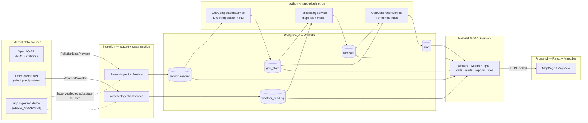

# Pollution Intelligence Platform

A pollution intelligence MVP: PM2.5 sensor ingestion, H3-grid spatial
interpolation, a heuristic pollution-pressure score, a wind-driven
short-range forecast, threshold-based alerting, and a map dashboard —
end to end, with one command (`python -m app.pipeline.run`) running the
whole thing and every model swappable behind a small interface.

This document is the developer-facing reference for the whole repo. For a
deeper narrative on *why* things are built the way they are (design
rationale, alternatives considered, full method lists), see
[`docs/architecture.md`](docs/architecture.md) — this README stays
focused on what exists and how to run it.

## Table of contents

1. [What this project does](#what-this-project-does)
2. [Quick start: step by step](#quick-start-step-by-step)
3. [MVP limitations](#mvp-limitations)
4. [Architecture](#architecture)
5. [Repository structure](#repository-structure)
6. [Data flow](#data-flow)
7. [Requirements](#requirements)
8. [Environment variables](#environment-variables)
9. [Local installation](#local-installation)
10. [Docker startup](#docker-startup)
11. [Database migrations](#database-migrations)
12. [Running ingestion](#running-ingestion)
13. [Running the complete pipeline](#running-the-complete-pipeline)
14. [Running the backend and frontend](#running-the-backend-and-frontend)
15. [Running tests](#running-tests)
16. [Demo mode](#demo-mode)
17. [Level of detail](#level-of-detail)
18. [Render modes](#render-modes)
19. [API overview](#api-overview)
20. [PDI: current definition and disclaimer](#pdi-current-definition-and-disclaimer)
21. [Forecast model: current assumptions](#forecast-model-current-assumptions)
22. [Known limitations](#known-limitations)
23. [Future extension points](#future-extension-points)

## What this project does

Given a bounding-box region, the platform:

1. **Ingests** recent PM2.5 sensor readings (OpenAQ) and current
   wind/precipitation (Open-Meteo) for that region.
2. **Interpolates** PM2.5 onto an [H3](https://h3geo.org/) hexagonal grid
   covering the region, via inverse-distance weighting from nearby
   stations.
3. **Scores** each grid cell with a heuristic "pollution pressure index"
   (PDI) — today, a normalized function of PM2.5 alone.
4. **Forecasts** PM2.5 forward 1h/3h/6h per cell with a deterministic,
   explainable wind-advection + decay box model.
5. **Alerts** on threshold crossings (now or forecast), sharp increases,
   and high-pressure-plus-worsening-trend cells, via a small rule-based
   engine — no machine learning anywhere in this MVP.
6. **Serves** all of the above through a versioned JSON API and a React +
   MapLibre map dashboard (current/forecast PM2.5, PDI, wind, alerts, a
   per-cell detail view).

Every step above is a manual trigger today (`python -m app.cli ...` or
`python -m app.pipeline.run`) — there is no scheduler yet. See
[MVP limitations](#mvp-limitations) and [Known limitations](#known-limitations).

### India boundary data

The map's India state/UT boundaries and country outline are sourced from
the **geoBoundaries ADM1 dataset** (geoBoundaries Global Database of
Political Administrative Boundaries, maintained by William & Mary's
geoLab). The data is simplified with mapshaper (10% keep-shapes) for web
use, with names normalized from diacritical forms to standard ASCII.

- **Source:** https://www.geoboundaries.org
- **License:** ODC-ODbL (Open Database License)
- **Coverage:** All 28 states and 8 union territories (post-2019
  J&K/Ladakh reorganization, post-2020 Dadra & Nagar Haveli / Daman &
  Diu merger)
- **Files:** `frontend/public/data/india_states.geojson` (state
  boundaries), `frontend/public/data/india_country.geojson` (country
  outline, dissolved from the same data)

**District boundaries** come from the same publisher's ADM2 release:
735 districts, simplified with mapshaper (5% keep-shapes) to 439 KB in
`frontend/public/data/india_districts.geojson`, on the same ODC-ODbL
terms. The file is drawn from level 2 up (`lib/staticLayers.ts` records
the exact build command), and it is also the polygon a district-scoped
search is masked to. The two publishers spell ~23% of district names
differently, so a scope resolves by name first and then by which polygon
contains the searched point.

The boundary layers are rendered as separate MapLibre sources, independent
of the basemap provider. See `frontend/src/lib/stateBoundaries.ts` for
the data source documentation and `frontend/src/components/MapView.tsx`
for the layer setup.

**Roads** come from **Natural Earth 10m roads** (public domain), clipped to
the same outline. Two classes are bundled: `india_highways.geojson`
(NE's `Major Highway` class, 111 corridors, 104 KB) drawn from level 3 up,
and `india_major_roads.geojson` (its `Road` class — the same scaleranks,
one class down, 155 lines, 56 KB) drawn from level 4 up. Both are coarse
selections that name the main corridors; neither is the full Indian
National Highway network, so expect the major routes you know and not the
local ones.

### Location search data

The top-right search bar searches states/UTs, districts, cities, and
localities. Its dataset is built from the **GeoNames India dump**,
filtered to administrative level 1 (states) and 2 (districts), populated
places (cities), sections of populated places (localities), and
additionally **populated places within 10 km of a major city** — small
neighbourhoods like Koramangala or Andheri are filed by GeoNames as plain
low-population places, so a population-only filter would miss exactly the
localities a user searches for.

- **Source:** https://download.geonames.org/export/dump/ (`IN.zip`)
- **License:** CC BY 4.0 (https://creativecommons.org/licenses/by/4.0/)
- **File:** `frontend/public/data/india_locations.json` — lazy-loaded on
  first search focus (not part of the initial page load)
- **Categories:** `state` (36), `district` (758), `city` (~2.9k),
  `locality` (~6.6k)

Selecting a result flies the map to that coordinate at a zoom tier
appropriate to the kind (see `ZOOM_BY_KIND` in `frontend/src/lib/locations.ts`).

## Quick start: step by step

The fastest way to see the whole thing running is **Demo Mode**: no API
keys, no live network dependency, and a guaranteed pollution hotspot with
forecasts and alerts (see [Demo mode](#demo-mode)). Every step below links
to the fuller reference section if you want more detail on it.

**1. Get the code and create config files.**

```bash
git clone <this repo's URL>
cd gdg-c4c
./scripts/bootstrap.sh   # copies .env.example -> .env, frontend/.env.example -> frontend/.env
```

No `bash` available? Copy `.env.example` to `.env` and
`frontend/.env.example` to `frontend/.env` by hand.

**2. Edit `.env`** (repo root): set `POSTGRES_PASSWORD` to any password,
and set `DEMO_MODE=true`. Leave `OPENAQ_API_KEY` blank for now — Demo
Mode doesn't need it.

Now pick **A** (you have Docker — recommended) or **B** (you don't).

### A) With Docker

**3.** Install [Docker Desktop](https://www.docker.com/products/docker-desktop/) and start it.

**4.** Start the database and API:
```bash
docker compose up --build
```
Wait for `Uvicorn running` in the log — migrations run automatically
(see [Docker startup](#docker-startup)). Leave this terminal open.

**5.** In a **second terminal**, load data:
```bash
docker compose exec api python -m app.pipeline.run
```
All five stages should print `[OK  ]` (see
[Running the complete pipeline](#running-the-complete-pipeline)).

**6.** In a **third terminal**, start the frontend:
```bash
cd frontend
npm ci
npm run dev
```

### B) Without Docker

**3.** Install PostgreSQL 16 with the PostGIS extension (on Windows: the
[EDB installer](https://www.postgresql.org/download/windows/), then run
Stack Builder and add PostGIS under Spatial Extensions).

**4.** Create the database and enable PostGIS, matching whatever
`POSTGRES_USER`/`POSTGRES_PASSWORD`/`POSTGRES_DB` you put in `.env`:
```sql
CREATE USER pollution WITH PASSWORD '...';
CREATE DATABASE pollution OWNER pollution;
\c pollution
CREATE EXTENSION postgis;
```

**5.** Set up and start the backend (see
[Running the backend and frontend](#running-the-backend-and-frontend) and
[Database migrations](#database-migrations) for more on these commands):
```bash
cd backend
python -m venv .venv
source .venv/bin/activate        # Windows: .venv\Scripts\activate
pip install -e ".[dev]"
alembic upgrade head
python -m app.pipeline.run       # loads data — all 5 stages should print [OK  ]
uvicorn app.main:app --reload    # leave this running
```

**6.** In a **second terminal**, start the frontend:
```bash
cd frontend
npm ci
npm run dev
```

### 7. Open the app

**http://localhost:5173.** The app is scoped to India: you should see the
whole country on load, state boundaries included, with a coarse,
generalized PM2.5 hex covering every part of the country, plus wind
arrows — see ["Level of detail"](#level-of-detail) below. Zoom into a
city (e.g. Delhi, the Demo Mode pipeline scenario's hotspot) to see
those give way to a real, finer per-hex grid for just that area. Check
**Show Pollution Development Index (PDI) layer** to switch to the
pressure score (only visible once zoomed in past the country tier);
click **+1h / +3h / +6h** to watch hotspots visibly move and disperse
downwind with the wind, not just fade in place; click any hex to open
its detail panel — the state it's in, PM2.5, PDI (plus a breakdown of
the four factors behind it), wind, temperature, humidity, precipitation,
confidence, and the forecast at each horizon; **Alerts** (top right)
lists what the rule engine raised.

Also useful: **http://localhost:8000/docs** (interactive API reference)
and **http://localhost:8000/health/ready** (confirms the database
connection — see [API overview](#api-overview)).

### Switching to live data later

1. Get a free key at [explore.openaq.org/register](https://explore.openaq.org/register).
2. In `.env`, set `DEMO_MODE=false` and `OPENAQ_API_KEY=<your key>`.
3. Re-run the pipeline (step 5 above). **No frontend changes are
   needed** — see the comparison table in [Demo mode](#demo-mode).

Sensor/weather readings from the previous mode stay in use for up to
`INGEST_MAX_READING_AGE_HOURS` (default 3h) after switching, since
they're not stale yet. To switch cleanly, clear the tables first:
```sql
TRUNCATE sensor_reading, weather_reading, grid_state, forecast, alert;
```

### Running the tests (optional)

```bash
cd backend && pytest                          # no database needed
cd ../frontend && npm run build && npm run lint
```
See [Running tests](#running-tests) for the full picture, including the
real-PostgreSQL suite (`RUN_DB_TESTS=1`).

## MVP limitations

Read this before assuming any of the following is out of scope by
accident rather than by design:

- **No scheduler.** Ingestion, grid computation, forecasting, and
  alerting are all triggered manually via CLI commands. A worker/cron
  calling the same services periodically is the natural next step (see
  [Future extension points](#future-extension-points)) but doesn't exist
  yet.
- **One pollutant.** Only PM2.5 is ingested, estimated, and forecast.
  `sensor_reading.pollutant` is already a free string (not tied to
  PM2.5), but `grid_state` and `forecast` have PM2.5-specific columns —
  see [Future extension points](#future-extension-points) for exactly
  what adding a second pollutant requires.
- **One region at a time.** One configured bounding box
  (`INGEST_BBOX_*`), one H3 resolution, one Postgres database. There is
  no multi-region/multi-tenant concept.
- **PDI is a heuristic, not a measurement.** See
  [PDI: current definition and disclaimer](#pdi-current-definition-and-disclaimer).
- **The forecast model is a simple box model, not atmospheric physics.**
  See [Forecast model: current assumptions](#forecast-model-current-assumptions).
- **No machine learning anywhere.** Interpolation is IDW, PDI is a
  weighted blend, the forecast model is a fixed-formula box model, and
  alerts are plain threshold comparisons. Nothing is trained on data.
- **No authentication or rate limiting** on the API — every route, on both
  `/api/v1/*` and `/api/v2/*`, is open and unauthenticated. They are
  `GET`-only except
  `POST /api/v1/reports` (citizen fire reports), which is also open —
  anyone can submit a report, and a malicious or careless one shifts the
  modeled plume (mitigated by validation, an age-based expiry and a
  per-cell PM2.5 cap, but abuse is a known, accepted gap for the MVP).
- **Fire reports are a triage heuristic.** The smoke slider maps to a
  modeled plume (see `app.services.fire_gradient`), not a measurement.
- **No live road/industrial/vegetation/satellite data.** PDI's
  `road_pressure`, `industrial_pressure`, and `vegetation_sink` inputs
  exist in the code but nothing real populates them yet (the demo
  fallback fabricates illustrative values for all three; see
  [PDI: current definition and disclaimer](#pdi-current-definition-and-disclaimer)).
- **Demo fallback is per-endpoint, not global.** If, say, `grid_state`
  has real rows but `forecast` doesn't yet, `/grid/current` returns real
  data while `/grid/forecast` returns demo data in the same session — see
  [API overview](#api-overview).

## Architecture



Every box that isn't a database table or a raw external API sits behind
a `Protocol` interface in `app/domain/`, with the concrete implementation
in `app/services/` or `app/ingestion/`:

| Protocol (`app/domain/...`) | Implementation | Purpose |
|---|---|---|
| `providers.PollutionDataProvider` | `ingestion.openaq.OpenAQProvider` (or `ingestion.demo.DemoPollutionDataProvider`) | Fetch PM2.5 readings |
| `providers.WeatherProvider` | `ingestion.open_meteo.OpenMeteoProvider` (or `ingestion.demo.DemoWeatherProvider`) | Fetch wind/precipitation |
| `estimation.PollutionEstimator` | `services.estimation.IDWPollutionEstimator` | Interpolate PM2.5 onto the grid |
| `pdi.PDIModel` | `services.pdi.HeuristicPDIModel` | Score pollution pressure per cell |
| `dispersion.PollutionForecastModel` | `services.dispersion.DeterministicH3DispersionModel` | Forecast PM2.5 forward |
| `repositories.*Repository` (5 of them) | `db.repositories.Sql*Repository` | Persistence, one per entity |

`app.ingestion.factory` is the single place that decides whether
ingestion gets the real providers or Demo Mode's substitutes (see
[Demo mode](#demo-mode)) — nothing downstream of ingestion knows or cares
which one ran.

## Repository structure

```
.
├─ docker-compose.yml          # db (PostGIS) + api services
├─ .env.example                # copy to .env
├─ backend/
│  ├─ alembic.ini
│  ├─ alembic/versions/        # hand-maintained: 0001_initial_schema.py + one ALTER per schema change since
│  ├─ app/
│  │  ├─ core/                 # config.py — Settings, read from .env
│  │  ├─ domain/                # pure types + Protocols, NO I/O
│  │  │  ├─ types.py            #   dataclasses: SensorReading, WeatherReading/Sample,
│  │  │  │                      #   GridState, Forecast, Alert, BoundingBox, Coordinate
│  │  │  ├─ providers.py        #   PollutionDataProvider, WeatherProvider
│  │  │  ├─ estimation.py       #   PollutionEstimator
│  │  │  ├─ pdi.py              #   PDIModel, CellContext, PDIResult
│  │  │  ├─ dispersion.py       #   PollutionForecastModel, ForecastResult
│  │  │  ├─ repositories.py     #   one Protocol per entity + DuplicateReadingError
│  │  │  ├─ h3_grid.py          #   the ONLY module that imports the h3 library
│  │  │  └─ numeric.py          #   clamp/clamp01 — shared by dispersion, pdi, demo_data
│  │  ├─ ingestion/             # openaq.py, open_meteo.py, demo.py, factory.py, http.py (shared retry)
│  │  ├─ models/                # tables.py — SQLAlchemy Core table definitions (the schema)
│  │  ├─ db/
│  │  │  ├─ session.py          #   engine/session factory
│  │  │  └─ repositories/       #   Sql*Repository — the only code that builds SQL
│  │  ├─ services/               # implementations + orchestration
│  │  │  ├─ estimation.py, pdi.py, dispersion.py   # the 3 model implementations above
│  │  │  ├─ geospatial.py       #   GeospatialService — the only caller of domain.h3_grid
│  │  │  ├─ ingestion.py        #   SensorIngestionService, WeatherIngestionService
│  │  │  ├─ grid_computation.py #   GridComputationService (estimator + PDI, one GridState row)
│  │  │  ├─ forecasting.py      #   ForecastingService (runs the dispersion model, persists)
│  │  │  ├─ alert_generation.py #   AlertGenerationService (the 4 write-side alert rules)
│  │  │  ├─ grid_query.py       #   resolve_cells — bbox+resolution -> capped H3 cell list (level of detail)
│  │  │  ├─ demo_data.py        #   is_demo:true fallback — continuous synthetic field over India
│  │  │  ├─ sensors.py, weather.py, grid.py, cells.py, alerts.py  # read-side, per API resource
│  │  │  └─ results.py          #   ServiceResult (data + is_demo)
│  │  ├─ api/
│  │  │  ├─ routes/             #   sensors, weather, grid, cells, alerts, health — thin
│  │  │  ├─ schemas.py          #   the public Pydantic response contract (Envelope[...])
│  │  │  ├─ errors.py           #   one consistent {"error": {...}} shape
│  │  │  ├─ deps.py             #   FastAPI dependency-injection wiring
│  │  │  └─ router.py           #   assembles /api/v1
│  │  ├─ pipeline/run.py        # composition root: python -m app.pipeline.run
│  │  ├─ cli.py                 # composition root: python -m app.cli <command>
│  │  └─ main.py                # FastAPI app entrypoint
│  ├─ tests/                    # see "Running tests"
│  ├─ pyproject.toml            # dependency ranges
│  └─ requirements.lock         # exact versions installed in Docker
├─ frontend/
│  ├─ public/
│  │  └─ data/                   # static map assets
│  │     ├─ india_states.geojson #   India state/UT boundaries (geoBoundaries ADM1, ODC-ODbL)
│  │     ├─ india_country.geojson#   India country outline (dissolved from the same ADM1 data)
│  │     └─ india_locations.json #   searchable states/districts/cities/localities (GeoNames, CC BY 4.0)
│  └─ src/
│     ├─ components/            # MapPage, MapView, SearchBar, AlertsPanel, CellDetailPanel, TimelineControl, ...
│     ├─ lib/                    # api.ts (the only backend fetch caller), lod.ts (zoom -> resolution/bbox),
│     │                          #   h3Geometry.ts, stateBoundaries.ts, locations.ts (place search),
│     │                          #   forecastFrames.ts (frame cache), smoothField.ts (smooth view),
│     │                          #   pm25Contours.ts (contrast mode), mapTheme.ts, colorScales.ts, format.ts, types.ts
│     ├─ hooks/                  # useApiResource.ts (loading/success/error/poll/retry, no data-fetching
│     │                          #   library), useStateBoundaries.ts
│     └─ state/                  # small useReducer + Context for UI-only state
├─ scripts/
│  ├─ bootstrap.sh              # copies .env.example → .env
│  └─ lock-backend.sh           # regenerates backend/requirements.lock (needs uv)
└─ docs/architecture.md         # design rationale, full method lists
```

**Layer boundaries are enforced, not just documented.**
`backend/tests/test_architecture.py` walks every file's imports and fails
the build if a layer imports one it isn't allowed to (e.g. `domain` may
import nothing under `app/`; `services` may import `domain`/`ingestion`/
`db`/`models` but not `api`). `app/cli.py`, `app/main.py`, and
`app/pipeline/run.py` are composition roots and are exempt — they're
allowed to import everything, since something has to wire it all
together.

## Data flow

```
OpenAQ ──┐                                   ┌── Open-Meteo
         ▼                                   ▼
  SensorIngestionService              WeatherIngestionService
         │                                   │
         ▼                                   ▼
   sensor_reading table              weather_reading table
         │                                   │
         ▼                                   │
  GridComputationService                     │
   (IDW interpolation,                       │
    then HeuristicPDIModel                   │
    on the same row)                         │
         │                                   │
         ▼                                   │
    grid_state table ◄────────────────────────
         │            \
         │             ╲
         ▼              ╲
  ForecastingService     │
  (DeterministicH3        │
   DispersionModel,       │
   reads grid_state +     │
   weather_reading)       │
         │                │
         ▼                │
    forecast table        │
         │                │
         ▼                ▼
      AlertGenerationService
      (reads grid_state + forecast,
       4 rules, at most 1 alert/cell/run)
         │
         ▼
      alert table
         │
         ▼
    FastAPI /api/v1/* + /api/v2/* ──── polled every 60s ──── React + MapLibre frontend
```

Everything above `sensor_reading`/`weather_reading` is a **manual
trigger** (`python -m app.cli <command>` or `python -m app.pipeline.run`)
— nothing runs on a timer. A single pipeline run persists real rows;
every `/api/v1/*` and `/api/v2/*` endpoint reads from its repository first and only
falls back to `app/services/demo_data.py`'s static illustrative values
(`is_demo: true`) if that repository query returns nothing at all. See
[API overview](#api-overview) and [Demo mode](#demo-mode) for the two
different meanings of "demo" in this codebase — they are unrelated
mechanisms that happen to share a name.

## Requirements

- [Docker Desktop](https://www.docker.com/products/docker-desktop/) (or Docker Engine + Compose v2)
- [Node.js](https://nodejs.org/) 20.19+ or 22.12+ (required by Vite 8)
- Python 3.11+ (only needed to run the backend or its tests outside Docker; the Docker image itself uses Python 3.12)
- An [OpenAQ API key](https://explore.openaq.org/register) (free) — only if you want real PM2.5 ingestion; not needed for [Demo mode](#demo-mode) or for running the API/frontend against demo fallback data
- No API key needed for Open-Meteo (weather)

## Environment variables

`.env` at the repo root is the **single configuration file** for Docker
Compose and the backend (`app/core/config.py` resolves it by absolute
path, so it's found whether you start from the repo root or `backend/`).
Real environment variables always override it. `frontend/.env` is
separate and only holds `VITE_API_BASE_URL`.

| Variable | Used by | Notes |
|---|---|---|
| `POSTGRES_USER`, `POSTGRES_PASSWORD`, `POSTGRES_DB` | db container, backend | **Required**, no defaults — Compose refuses to start without them |
| `POSTGRES_HOST`, `POSTGRES_PORT` | backend | For host-side runs (`localhost:5432`). Compose overrides both to `db:5432` for the `api` container |
| `API_PORT` | Compose | Host port for the API |
| `ENVIRONMENT`, `LOG_LEVEL`, `CORS_ORIGINS` | backend | Plain app config; `CORS_ORIGINS` is comma-separated |
| `DEMO_MODE` | ingestion | Default `false`. See [Demo mode](#demo-mode) |
| `H3_RESOLUTION` | backend | 0-15, default `8`. Changing it on an existing database does **not** rewrite stored `h3_cell` values — treat a change as a breaking change to stored data |
| `GRID_QUERY_MAX_CELLS` | backend | Safety ceiling (default 50000) on one level-of-detail read (`/grid/current`, `/grid/forecast`, `/weather` with a bbox) — see [Level of detail](#level-of-detail) |
| `OPENAQ_API_KEY` | ingestion | Required for real PM2.5 ingestion. Leave blank to run everything else (API, frontend, demo fallback, Demo Mode) without it |
| `OPENAQ_BASE_URL`, `OPENAQ_TIMEOUT_SECONDS`, `OPENAQ_MAX_RETRIES`, `OPENAQ_LOCATIONS_LIMIT` | ingestion | OpenAQ adapter tuning |
| `OPEN_METEO_BASE_URL`, `OPEN_METEO_TIMEOUT_SECONDS`, `OPEN_METEO_MAX_RETRIES`, `OPEN_METEO_MAX_LOCATIONS_PER_REQUEST` | ingestion | Open-Meteo adapter tuning; no key needed |
| `WEATHER_MAX_CELLS` | ingestion | Safety ceiling (default 50000) on one weather run's fan-out; an oversized bbox is refused rather than building millions of rows |
| `WEATHER_H3_RESOLUTION` | ingestion | Coarser resolution (default 5) weather is sampled at, fanned out to every `H3_RESOLUTION` cell inside. Must be ≤ `H3_RESOLUTION` (enforced by a `Settings` validator) |
| `INGEST_BBOX_MIN_LAT`/`MIN_LON`/`MAX_LAT`/`MAX_LON` | ingestion | Bounding box, shared by `ingest` and `ingest-weather` (default: Delhi NCR — a single city/region, not all of India; see [Level of detail](#level-of-detail)) |
| `INGEST_MAX_READING_AGE_HOURS` | ingestion | A fetched PM2.5 reading older than this is dropped as stale (default 3h) |
| `IDW_MAX_DISTANCE_KM` | estimation | Max distance (default 15km) a sensor may be from a cell center to count as evidence |
| `IDW_MIN_SENSORS` | estimation | Min sensors (default 2) required in range before a cell gets an estimate at all |
| `PDI_PM25_REFERENCE_UGM3` | PDI | PM2.5 (default 250) treated as "maximum pressure" when normalizing to `[0, 1]` — a normalization scale, not a scientific threshold |
| `PDI_PM25_WEIGHT`, `PDI_ROAD_PRESSURE_WEIGHT`, `PDI_INDUSTRIAL_PRESSURE_WEIGHT`, `PDI_VEGETATION_SINK_WEIGHT` | PDI | Relative weights (default 0.7 / 0.2 / 0.1 / -0.15 — the last negative, since vegetation is a sink); renormalized over whichever factors are actually present for a cell. Also drives `app/services/demo_data.py`'s illustrative PDI |
| `DISPERSION_DECAY_RATE_PER_HOUR`, `DISPERSION_WET_REMOVAL_RATE_PER_HOUR`, `DISPERSION_PRECIPITATION_REFERENCE_MM` | dispersion | Baseline + precipitation-driven removal per hour (defaults 0.15, 0.25, 4mm) |
| `DISPERSION_MAX_TRANSPORT_FRACTION`, `DISPERSION_WIND_TRANSPORT_REFERENCE_MS`, `DISPERSION_CALM_WIND_THRESHOLD_MS` | dispersion | How much PM2.5 wind can move per hour, and at what speeds (defaults 0.6, 8 m/s, 0.5 m/s) |
| `DISPERSION_WIND_CONE_HALF_ANGLE_DEG` | dispersion | Half-angle (default 50°) of the downwind neighbor-selection cone |
| `DISPERSION_CONFIDENCE_DECAY_PER_HOUR`, `DISPERSION_MISSING_WEATHER_CONFIDENCE_PENALTY` | dispersion | Per-hour confidence discount, and an extra one for a cell with no weather reading (defaults 0.9, 0.5) |
| `ALERT_WARNING_THRESHOLD_UGM3`, `ALERT_CRITICAL_THRESHOLD_UGM3` | alerts | PM2.5 at/above which a cell alerts WARNING/CRITICAL now, or WATCH if only a forecast reaches it (defaults 91, 121 — the CPCB NAQI Poor/Very Poor PM2.5 boundaries, matching the map's color bands; `backend/tests/test_alert_threshold_bands.py` guards the alignment) |
| `ALERT_SHARP_INCREASE_THRESHOLD_UGM3` | alerts | Current-to-forecast jump (µg/m³) counted as a "sharp increase" alert (default 25) |
| `ALERT_PDI_HIGH_THRESHOLD`, `ALERT_PDI_WORSENING_MIN_INCREASE_UGM3` | alerts | PDI considered "high pressure", and the smaller PM2.5 increase counted as "worsening" alongside it (defaults 60, 5) |
| `ALERT_ACTIVE_LOOKBACK_HOURS` | alerts | A cell with an alert created within this many hours is skipped on the next run, and is what `/api/v1/alerts` considers "active" (default 24) |
| `VITE_API_BASE_URL` (in `frontend/.env`) | frontend | Where the frontend calls the backend |

The backend builds its database URL from the `POSTGRES_*` parts, so
credentials are defined once. See `.env.example` for every default,
inline.

## Local installation

```bash
git clone <this repo>
cd gdg-c4c

# Copies .env.example -> .env and frontend/.env.example -> frontend/.env
./scripts/bootstrap.sh

# Edit .env: at minimum, change POSTGRES_PASSWORD.
# Add OPENAQ_API_KEY if you want real PM2.5 ingestion (optional — see
# Demo mode and "API overview" for what works without one).
```

From here you can either run everything in Docker ([Docker startup](#docker-startup))
or run the backend directly on the host ([Running the backend and frontend](#running-the-backend-and-frontend)).
Either way, the frontend always runs on the host with `npm run dev` (see
that section for why).

## Docker startup

```bash
docker compose up --build
```

This starts two services (`docker-compose.yml`):

- **`db`** — `postgis/postgis:16-3.4`, with a healthcheck (`pg_isready`)
  that gates the `api` container's startup.
- **`api`** — builds `backend/Dockerfile`, runs
  `alembic upgrade head && uvicorn app.main:app --reload` (migrations
  run automatically, every start — a no-op once the schema is already at
  head), and only reports healthy once `GET /health/ready` returns 200
  (PostGIS reachable).

The frontend is **not** in Docker Compose — run it on the host (see
[Running the backend and frontend](#running-the-backend-and-frontend)),
since Vite's dev server hot-reloads faster there than inside a container
on Windows.

| URL | What it is |
|---|---|
| http://localhost:8000/health | Liveness — the process is up, never touches the DB |
| http://localhost:8000/health/ready | Readiness — PostgreSQL reachable + PostGIS installed (200 or 503) |
| http://localhost:8000/docs | Swagger UI for every endpoint (v1 and v2) |
| http://localhost:8000/api/v1/sensors | Try it — demo data until ingestion has run (raw station audit trail; no client calls it) |

To run a CLI command inside the running `api` container instead of a
separate host install:

```bash
docker compose exec api python -m app.cli ingest-weather
```

## Database migrations

Docker Compose applies migrations automatically on every `api` container
start (see above). Outside Docker:

```bash
cd backend
alembic upgrade head          # apply migrations
alembic downgrade -1          # roll back one revision
```

The schema is defined once, in code, as SQLAlchemy Core `Table` objects
in `app/models/tables.py` — five tables: `sensor_reading`,
`weather_reading`, `grid_state`, `forecast`, `alert`. It is mirrored **by
hand** across `alembic/versions/` (`0001_initial_schema.py`'s `CREATE
TABLE`s, plus one `ALTER TABLE` migration per schema change since —
`0002_weather_temp_humidity.py` is the first); there is a test
(`backend/tests/test_migrations_offline.py`) that asserts the *combined*
DDL of the whole migration chain and the live table metadata agree
column-for-column and constraint-for-constraint, specifically because
there's no live database available in this project's history to
`alembic revision --autogenerate` against. **If you add or change a
column in `tables.py`, you must hand-write the matching migration
yourself** — nothing generates it for you.

**Always add a new migration for a schema change — never edit an old
one in place**, the moment any real database might already exist at
that revision. `0001_initial_schema.py` was itself edited in place a few
times early on (there was no live database yet to run it against, so it
cost nothing) — until one existed and `alembic upgrade head` silently
became a no-op against it (a database already at revision `0001`
doesn't re-run `0001`, edited or not), leaving `weather_reading` missing
columns the rest of the app assumed existed
(`column "temperature" of relation "weather_reading" does not exist`).
`0002_weather_temp_humidity.py` is both the fix for that specific
column and the template for every migration after it: run `alembic
upgrade head` (`docker compose exec api alembic upgrade head` under
Docker) against an existing database to pick up new migrations like it.
Keep every revision id at or under 32 characters — alembic's own
`alembic_version.version_num` column is `VARCHAR(32)`, and a longer id
fails on the final `UPDATE alembic_version` step with
`StringDataRightTruncation`, rolling back the whole migration.

Only `app/db/repositories/*.py` builds SQL against these tables directly;
everything above `app/db` depends on the `app.domain.repositories`
Protocols instead.

## Running ingestion

```bash
cd backend
python -m app.cli ingest                                    # PM2.5, bbox from .env
python -m app.cli ingest-weather                             # weather, bbox from .env
python -m app.cli ingest --min-lat 28.4 --min-lon 76.8 \
                          --max-lat 28.9 --max-lon 77.4      # override for one run
```

- **`ingest`** requires `OPENAQ_API_KEY` (unless `DEMO_MODE=true` — see
  [Demo mode](#demo-mode)) and a running database. Fetches recent PM2.5
  readings for the bounding box, normalizes them into `SensorReading`,
  and saves them — skipping exact duplicates (same
  source/sensor/pollutant/timestamp) and stale readings (older than
  `INGEST_MAX_READING_AGE_HOURS`).
- **`ingest-weather`** never needs an API key. It samples weather at a
  coarser H3 resolution (`WEATHER_H3_RESOLUTION`) than the grid and fans
  each sample out to every fine `H3_RESOLUTION` cell it covers — one
  batched Open-Meteo request typically produces far more `WeatherReading`
  rows than points requested, deliberately (weather varies far less than
  PM2.5 over a city block).

Both commands print a message and exit 1 on a network, API, or database
failure — never an uncaught traceback. There is no scheduler; these are
manual triggers for local development.

## Running the complete pipeline

```bash
cd backend
python -m app.pipeline.run
```

Runs the full vertical slice for the configured region in one command:

```
OpenAQ -> sensor ingestion -> H3 grid + PM2.5 interpolation -> PDI
-> Open-Meteo -> weather ingestion -> dispersion model -> 1h/3h/6h
forecasts -> alerts
```

Prints one line per stage (`[OK  ] sensor_ingestion: fetched=12 saved=10 ...`
or `[FAIL] ...: <reason>`) and exits 1 if any stage failed. Every stage is
its own orchestration service, independently tested
(`SensorIngestionService`, `WeatherIngestionService`,
`GridComputationService`, `ForecastingService`, `AlertGenerationService`)
— `app/pipeline/run.py` only wires them together in order.

**A failed external data source doesn't corrupt or abort the run.** If
OpenAQ or Open-Meteo is unreachable, that stage is reported as a clear
failure (and the process exits 1), but every later stage still runs —
`IDWPollutionEstimator` returns `pm25=None`/`confidence=0.0` rather than a
fabricated estimate when there isn't enough evidence, and
`DeterministicH3DispersionModel` forecasts decay-only for a cell with no
weather reading. Only the database itself being unreachable aborts the
whole run.

`GridComputationService` estimates PM2.5 (`IDWPollutionEstimator`) and
folds in PDI (`HeuristicPDIModel`) onto the **same** `GridState` row, then
persists every cell's row in one round trip. `ForecastingService` then
persists every `(cell, horizon)` forecast from that run in one round
trip too — both are one bulk database write per pipeline run, not one
write per cell (a deliberate fix; see the git history for the
before/after if you're curious).

There is no scheduler yet — a worker or cron job calling
`python -m app.pipeline.run` periodically is the natural next step and
wouldn't need any code here to change.

## Running the backend and frontend

**Backend**, outside Docker (with the database from `docker compose up -d db`):

```bash
cd backend
python -m venv .venv
source .venv/bin/activate        # Windows: .venv\Scripts\activate
pip install -e ".[dev]"
uvicorn app.main:app --reload
```

Dependencies: edit ranges in `pyproject.toml`, then run
`./scripts/lock-backend.sh` to regenerate `requirements.lock` (the exact
versions installed in Docker).

**Frontend**, always on the host (faster hot-reload than Vite in Docker
on Windows):

```bash
cd frontend
npm ci             # exact versions from package-lock.json
npm run dev        # dev server, http://localhost:5173
npm run build      # type-check + production build
npm run lint       # oxlint
npm run format     # prettier --write
```

It's a single full-screen MapLibre GL JS map, one page, no router
(`src/components/MapPage.tsx`). H3 hex boundaries are computed
client-side with `h3-js` from the plain `h3_cell` strings the API
returns — there's no GeoJSON endpoint. `src/lib/api.ts` is the only
module that calls `fetch`; all pollution/forecast/PDI math stays
server-side.

## Running tests

**Backend:**

```bash
cd backend
pytest                                   # unit tests, no database needed
RUN_DB_TESTS=1 pytest                    # also runs real-PostgreSQL round-trip tests
ruff check . && ruff format --check .
```

Most of the suite runs against in-memory fakes (`tests/fakes.py`) and
needs no database at all — including `test_migrations_offline.py`
(compiles the Alembic migration against the PostgreSQL dialect without
connecting to one) and `test_repository_statements_compile.py` (same
idea for every repository's SQL statements). `RUN_DB_TESTS=1` additionally
runs `tests/test_repositories.py` and `tests/test_db_integration.py`
against a real PostgreSQL/PostGIS instance (`docker compose up -d db`
first). `tests/test_architecture.py` enforces the layer-import rules
described in [Repository structure](#repository-structure).
`tests/test_mvp_scenarios.py` is a targeted resilience pass (15
scenarios: provider failures, database unavailability, stale/missing
data, calm wind, heavy rain, etc.) — see that file's docstring for the
full list. `tests/test_demo_mode.py` runs the real pipeline services
against Demo Mode's fixed dataset end to end (see [Demo mode](#demo-mode)).

**Frontend:** there is no test runner configured. `npm run build`
(type-checks via `tsc -b` then builds) and `npm run lint` (`oxlint`) are
the checks that exist; run both before committing a frontend change.

## Demo mode

```bash
# .env
DEMO_MODE=true
```

```bash
cd backend
python -m app.pipeline.run     # or ingest / ingest-weather / forecast individually
```

For running the whole thing with no live network connection and no API
keys — hackathon judging, offline demos, CI. `DEMO_MODE=true` substitutes
a fixed, deterministic PM2.5/wind dataset (`app.ingestion.demo`) for
OpenAQ/Open-Meteo, chosen by `app.ingestion.factory` — that and seeding
two fixed fire sightings (`app.ingestion.demo_reports`, so the
fire-gradient contribution and `GET /api/v1/reports` are demoable) are
the only things it changes. Every stage after ingestion (H3 grid
coverage, IDW interpolation, PDI, the dispersion model, alert
generation, persistence, the API) is the exact same code path as live
mode, running for real against this synthetic input. There is no
separate demo API response shape, and no `if demo_mode` branch anywhere
outside `app.ingestion.factory` and the pipeline's seeding stage.

The scenario is a smog-episode-scale PM2.5 hotspot (280 µg/m³, central
Delhi) with four lower background readings around it and a steady 6 m/s
westerly wind, chosen so a pipeline run against it is
guaranteed — with no non-default configuration — to produce a clearly
visible hotspot, forecast values that visibly carry it downwind over
+1h/+3h/+6h, and at least one CRITICAL alert (280 is comfortably past the
default `ALERT_CRITICAL_THRESHOLD_UGM3=121.0`). `backend/tests/test_demo_mode.py`
asserts exactly this, running the real services. The two fire sightings
sit inside IDW sensor coverage (augment-only blending would otherwise
make them invisible) and away from the hotspot, so the map shows a
separate, sharper plume where they're reported.

**`DEMO_MODE` is unrelated to a response's `is_demo` flag.** This is the
single most likely point of confusion in the whole codebase, so it's
worth stating plainly:

| | `DEMO_MODE=true` | `is_demo: true` in a response |
|---|---|---|
| What it is | An ingestion-time config flag | A per-response flag in the `Envelope` |
| What it changes | Which provider fetches sensor/weather data | Whether the response is real persisted data or a static fallback |
| Where it's decided | `app.ingestion.factory`, once, at ingestion time | Each service (`app/services/{sensors,weather,grid,cells,alerts}.py`), per request, by checking whether its repository query returned anything |
| Effect on persisted data | Produces real, computed, persisted rows | N/A — nothing is persisted for the fallback |
| Effect on `is_demo` | None — stays `false`, same as live mode | This flag itself |

## Level of detail

The app is scoped to **India**, and never loads fine-resolution data for
the whole country at once. What's on screen is driven entirely by the
current **zoom level**, via `frontend/src/lib/lod.ts`'s `lodForZoom`:

| Level | Zoom | H3 resolution | ~Cell area | Scope of the request |
|---|---|---|---|---|
| 1 (country) | < 6 | 3 | ~12,400 km² | Always all of India (`INDIA_BBOX`) - always ~800 cells, too small to bother scoping to viewport |
| 2 (state) | 6 - 7 | 4 | ~1,770 km² | The current map viewport |
| 3 (state) | 7 - 8 | 5 | ~253 km² | The current map viewport |
| 4 (state) | ≥ 9 | 6 | ~36 km² | The current map viewport |

Resolution steps up by exactly one H3 level per tier (a ~7x jump in cell
density each time), and the ceiling is `MAX_ZOOM` (= 10).

**Why level 4 needs no new data.** A published run carries a native
resolution (8 in this deployment) and the v2 read aggregates its native
cells up into whatever display resolution is asked for, refusing only a
resolution *finer* than native. Res 6 is therefore the same measurements
averaged into smaller parents than res 5 - genuinely finer detail, not
interpolation. The ceiling sits at res 6 because that is what a viewport
read can serve: res 7 is ~1,340 cells for a city-sized viewport and res 8
times out. `GET /api/v2/meta` reports the range as
`supported_display_resolutions`, which is every resolution from 3 to the
run's native one.

Weather (wind
arrows) uses this same resolution at every tier *except* country, where
it deliberately requests a coarser resolution (2, not 3) than the PM2.5
grid — the map only ever renders a thinned-down, sparse subset of wind
points anyway, so fetching them at the grid's full country-tier
resolution would be wasted payload (measured: ~210KB → ~29KB).

On load the map fits all of India (`INDIA_BOUNDS` in
`frontend/src/components/MapView.tsx`) and shows the coarse country
tier: a full nationwide PM2.5 choropleth (not sparse dots — see "Where
the data comes from today" below) plus wind currents — "generalized"
because the resolution itself is coarse, not because anything is
hidden. Zoom into a region and the same hex/wind/PDI layers this README
describes elsewhere start rendering denser, finer cells for just that
area, up to level 4. PDI renders at every tier, the bare country overview
included: the backend area-weights the per-cell score when a read is
coarser than the published native resolution (see
`app/services/prediction_queries.py`), so a level-1 cell carries an
aggregated PDI rather than no value. Clicking any hex opens the same
full detail panel (location, PM2.5, PDI + its factor breakdown, wind,
weather, forecast, confidence) regardless of tier.

**How the frontend decides what to fetch** — `frontend/src/lib/lod.ts`'s
`lodForZoom(zoom)` maps the current zoom to `{ resolution, bbox? }`.
`components/MapView.tsx` reports the live viewport (zoom + bounds) to
`MapUiContext` on `moveend` (debounced 300ms so a fast scroll-wheel
flick doesn't fire one request per tick); `components/MapPage.tsx` reads
that state and passes `{ resolution, bbox }` into `fetchGridCurrent` /
`fetchGridForecast` / `fetchWeather` (`frontend/src/lib/api.ts`), which
send them as `resolution`/`min_lat`/`min_lon`/`max_lat`/`max_lon` query
params. Viewport-scoped tiers (levels 2 and 3) wait for a real viewport
before fetching (never fall back to "no bbox" for a fine resolution — see
below).

**How the backend supports this** — every one of those three endpoints
accepts an optional `resolution` and an optional bounding box
(`app.api.deps.get_bbox_query`: all four of `min_lat`/`min_lon`/`max_lat`/
`max_lon` together, or none — a partial set is a 422). Given both,
`app.services.grid_query.resolve_cells` computes exactly the H3 cells at
that resolution covering that bbox (`GeospatialService.region_coverage`,
the same method the ingestion pipeline already used) and the service
reads only those cells (`GridStateRepository.latest_in_cells` and its
`ForecastRepository`/`WeatherReadingRepository` equivalents) — a cell
with no row is simply absent, never fabricated. **`resolution` only
takes effect together with a bbox** — omitting bbox entirely preserves
the exact pre-level-of-detail behavior (return whatever is persisted,
unfiltered, at the configured default `H3_RESOLUTION`), since "no bbox"
already meant something before this feature existed and silently
reinterpreting it as "resolution N, nationwide" would risk a client
that forgets the bbox asking for millions of cells by accident.

**The safety net, and why there are two checks, not one:**
`GRID_QUERY_MAX_CELLS` (default 50,000) caps how many cells one
resolution+bbox request may cover. Enumerating the cells first and
checking the count after is itself too expensive to be the only guard —
at a fine resolution, a country-sized bbox is millions of cells, and
building that list before rejecting it measured **22 seconds** in
testing. `resolve_cells` rejects an obviously oversized request from its
*area* alone first (`h3.average_hexagon_area`, an O(1) lookup — no
enumeration), in well under a second, and only falls through to the
exact count for requests already in a plausible range. The zoom
breakpoints above aren't arbitrary either: they were tuned against a
table of real `resolve_cells` counts for both a full-India and a
single-city desktop viewport at every candidate resolution (see the
comment above `lodForZoom` in `frontend/src/lib/lod.ts`) so that an
ordinary zoom-in/out gesture on an ordinary screen stays comfortably
under the cap at every step; a very large/ultra-wide monitor can still
occasionally exceed it at a tier's lowest zoom, which the backend
rejects with a clear 422 rather than truncating silently.

**A cell fetched from a coarser tier and passed back** —
`GET /api/v1/cells/{h3_cell}` also accepts an optional `resolution`,
because an `h3_cell` string is only valid at the resolution it was
minted at. Clicking a country/state-tier hex is rejected as "invalid
cell" unless the frontend passes that same resolution back; it does this
automatically (`selectedCellResolution` in `MapUiContext`, captured at
click time — not read live from the current zoom, since the user may
have zoomed again before the detail panel finishes loading).

**Where the data comes from today** (all dummy/illustrative — see
[MVP limitations](#mvp-limitations)):

- `app/services/demo_data.py` — the `is_demo: true` fallback shown when
  a repository is empty — is a **continuous synthetic field over all of
  India**, not a lookup table of ~19 cities: every cell anywhere in the
  country gets a value (rural regions genuinely lower, not absent), built
  from a smooth regional background (inverse-distance-weighted from a
  dozen hand-placed climate/pollution anchors — the Indo-Gangetic plain
  markedly worse than the Western Ghats, Thar desert hot/dry/windy, etc.)
  plus Gaussian "hotspot" bumps for ~19 major cities (a handful flagged
  industrial) and 2 standalone synthetic anomalies (e.g. a crop-residue
  burning plume), so the map reads as a plausible national picture rather
  than sparse dots. Forecasts (`+1h`/`+3h`/`+6h`) advect and disperse each
  hotspot downwind using its local wind (see
  [Forecast model: current assumptions](#forecast-model-current-assumptions))
  so stepping through the timeline visibly shows pollution moving, not
  every cell's number just changing in place. Deterministic and cached
  per-cell within a process — same seed, same numbers, every run.
- `app/ingestion/demo.py` (`DEMO_MODE=true`) and `INGEST_BBOX_*`'s
  default both point at **Delhi NCR** — a real pipeline run (ingestion,
  IDW, PDI, dispersion, alerts) only ever covers one city-sized region
  at a time, same as before this app was scoped to India; see
  [Demo mode](#demo-mode). Nothing about this pipeline changed — it
  isn't what powers the level-of-detail reads above, and is a
  completely separate concept from `app/services/demo_data.py`.

## Render modes

The pollution field has two renderings, switchable from the **layer
panel**; the selection is UI state (`viewMode` in
`frontend/src/state/mapUiReducer.ts`), not a backend/API concern.

- **Hex cells** (default) — the discrete H3 hexagons, one value per cell.
- **Smooth** — the same per-cell values as a continuous raster
  (`frontend/src/lib/smoothField.ts`): a compact weighted average over
  nearby cell centers, bilinearly upsampled and georeferenced to the view
  bbox. Rows are mapped in Web Mercator Y to stay aligned with the map.

Both views use the **exact same color ramp** (`frontend/src/lib/colorScales.ts`),
so the legend is valid in either. Bands run Very Good → Hazardous at
**0 / 25 / 35 / 50 / 80 / 150 / 250 µg/m³** (the lowest being a deep green),
and that one array also drives the smooth field's sampling and contrast
mode's band boundaries.

**Contrast mode** (a checkbox, available in both views) draws a line on the
boundary between different PM2.5 bands (`frontend/src/lib/pm25Contours.ts`).
In the hex view it draws the shared hex edges whose two cells are in
different bands, outlining each same-range region topologically rather than
tracing every hexagon. In the smooth view it runs marching squares across
the smoothed field's own grid, so the boundaries are smooth topographic
iso-lines that follow the surface the raster draws - the two builders share
one grid per frame, so the lines and the raster can't disagree.

**Playback works identically in both views.** `components/MapView.tsx`
double-buffers the field — two hex sources *and* two raster image sources
— and the frame pipeline writes the new frame to the hidden buffer, then
dissolves by opacity with a constant-coverage curve (so the grid never
dims mid-transition; only the colors shift). The same path serves the
timeline animation, manual jumps, the PDI toggle, and contrast-mode
contours, which dissolve in step with the fills they describe.

## API overview

Base paths `/api/v1` and `/api/v2`, plus unversioned `/health` and
`/health/ready`. Interactive docs at `/docs` once the API is running.
`/api/v2` serves versioned, run-pinned prediction publications (see
[docs/architecture.md](docs/architecture.md)'s "Environmental publication API");
`/api/v1` is the original contract, still used by both clients for citizen
reports and by the web for the FIRMS layer.

| Endpoint | Returns | Called by |
|---|---|---|
| `GET /health` | Liveness - process up, never touches the DB | infra only (compose healthcheck, deploy smoke tests) |
| `GET /health/ready` | Readiness - PostgreSQL reachable + PostGIS installed | infra only (compose waits on it, go-live checks it) |
| `GET /api/v1/sensors` | Latest reading per sensor (raw ingestion audit trail - the only endpoint that names a `source`) | **nothing** - see below |
| `GET /api/v1/weather?resolution=&min_lat=&min_lon=&max_lat=&max_lon=` | Latest weather per H3 cell | **nothing** - superseded by `/api/v2/weather` |
| `GET /api/v1/grid/current?resolution=&min_lat=&min_lon=&max_lat=&max_lon=` | Current PM2.5 + PDI per cell | **nothing** - superseded by `/api/v2/grid/current` |
| `GET /api/v1/grid/forecast?hours=1\|3\|6&resolution=&min_lat=&min_lon=&max_lat=&max_lon=` | Forecast PM2.5 per cell at that horizon | **nothing** - superseded by `/api/v2/grid/forecast` |
| `GET /api/v1/cells/{h3_cell}?resolution=` | Current state + forecasts + weather + PDI factor breakdown for one cell (404 if no data at all, 422 if `h3_cell` isn't valid at the configured resolution) | **nothing** - superseded by `/api/v2/cells/{h3_cell}` |
| `GET /api/v1/alerts` | Alerts created within `ALERT_ACTIVE_LOOKBACK_HOURS` | **nothing** - superseded by `/api/v2/alerts` |
| `POST /api/v1/reports` | Store a citizen report of an active fire/burning event (kind, location, smoke slider 1-5, duration estimate, optional note); returns it with the H3 cell it snapped to. Idempotent on `client_report_id`. | web + app |
| `GET /api/v1/reports` | Fire/burning reports within `FIRE_REPORT_MAX_AGE_HOURS` (the same window the fire gradient model trusts a report for) | web + app |
| `GET /api/v1/fires?since_hours=&min_lat=&min_lon=&max_lat=&max_lon=` | NASA FIRMS detections the backend has ingested, worst FRP first, capped at 2000 | web |
| `GET /api/v1/tiles/gibs/{layer}/{z}/{y}/{x}?date=` | One NASA GIBS WMTS tile, proxied and cached by the backend (`layer` is `truecolor` or `aod`) | web |
| `GET /api/v1/tiles/no2/{z}/{y}/{x}` | One Sentinel-5P NO2 WMS GetMap tile, proxied with the credential held server-side (404 while `NO2_WMS_URL` is unset) | web |
| `GET /api/v2/meta` | Run identity, mode, resolution and forecast anchors | web + app |
| `GET /api/v2/grid/current?run_id=&resolution=&bbox` | Concentration, centroid, provenance and per-cell exposure | web + app |
| `GET /api/v2/grid/forecast?hours=&run_id=&resolution=&bbox` | Published anchors and 15-minute interpolations | web + app |
| `GET /api/v2/cells/{h3_cell}?run_id=&resolution=` | Current, anchor forecasts, weather, static features and exposure | web only (the app has no per-cell detail read) |
| `GET /api/v2/weather?hours=&run_id=&resolution=&bbox` | Run-pinned weather and source versions | web + app |
| `GET /api/v2/alerts?run_id=` | Alerts derived from that publication | web + app |
| `GET /api/v2/exposure?hours=&threshold_pm25=&run_id=&resolution=&bbox` | Population-weighted concentration and covered/unknown population for the whole scope | **nothing** - see below |

**Why the web doesn't call `/api/v1/sensors` or `/api/v2/exposure`.** Both are
deliberate, not oversights. `/api/v1/sensors` is the raw station audit trail
(`source`, `external_sensor_id`, `pollutant`, `value`) with no station UI on
either client; the web's citizen layer shows *human* fire reports (kind, smoke
slider, duration) and so reads `/api/v1/reports` instead - different data, not
a different view of the same data. `/api/v2/exposure` is the one-summary-per-
region roll-up, while the web already reads the per-cell `exposure` field that
ships on `/api/v2/grid/current`, `/api/v2/grid/forecast` and
`/api/v2/cells/{h3_cell}` and renders it in the drawer and as its "Exposure"
map metric. Both routes are kept and documented rather than removed; the full
route-to-consumer mapping, and why the legacy v1 map routes are still served,
is in [docs/architecture.md](docs/architecture.md)'s API section.


`resolution` and the four bbox params are optional and independent of
each other's endpoint — see [Level of detail](#level-of-detail) for the
full level-of-detail contract (all four bbox params together or none;
`resolution` alone has no effect).

Every successful response is an **Envelope**:

```json
{
  "generated_at": "2026-01-01T12:00:00Z",
  "is_demo": false,
  "data": [...]
}
```

`is_demo` is `true` only when the underlying repository query returned
nothing and `app/services/demo_data.py`'s illustrative values are shown
instead — never mix real and fabricated values without this flag. It's
also the *only* signal a response ever gives about provenance: no field,
at any of these endpoints, ever names OpenAQ, Open-Meteo, "demo", or any
future source (satellite, a government sensor feed, ...) — see
`tests/test_api_contract.py`, which pins this down. See
[Demo mode](#demo-mode) for how `is_demo` differs from `DEMO_MODE`.

Every error response — a raised `HTTPException`, a request-validation
failure, or an unhandled exception — is:

```json
{"error": {"code": "not_found", "message": "...", "details": [...]}}
```

(`details` is omitted when there's nothing extra to say). All routes are
`GET`-only, unauthenticated, and CORS-restricted to `CORS_ORIGINS`.

**Alerts in detail** — `AlertGenerationService` is a small rule-based
engine (no ML). Rules run in priority order per cell; the first match
wins, so a cell gets at most one alert per pipeline run:

1. **Threshold crossed now** — current PM2.5 ≥ `ALERT_WARNING_THRESHOLD_UGM3`
   / `ALERT_CRITICAL_THRESHOLD_UGM3` → `WARNING` / `CRITICAL`.
2. **Threshold crossed in the forecast** — no current exceedance, but
   some horizon reaches a threshold → `WATCH`.
3. **Sharp increase** — current-to-forecast jump ≥
   `ALERT_SHARP_INCREASE_THRESHOLD_UGM3` at some horizon → `WATCH`.
4. **High PDI + worsening forecast** — current PDI ≥
   `ALERT_PDI_HIGH_THRESHOLD` *and* a horizon at least
   `ALERT_PDI_WORSENING_MIN_INCREASE_UGM3` above current → `WATCH`.

Only rule 1 can produce `WARNING`/`CRITICAL`; every other rule is
`WATCH` regardless of magnitude, since severity here encodes *when* a
condition is true, not just how severe it is. A cell with an alert
already created within `ALERT_ACTIVE_LOOKBACK_HOURS` is skipped, so a
persistent condition doesn't spawn a new alert every run.

## PDI: current definition and disclaimer

> **The Pollution Development Index (PDI) is a heuristic
> pollution-pressure score. It is NOT a scientifically exact measurement
> of emissions, absorption, or a modeled pollutant budget, and it is
> deliberately independent of PM2.5 — the two can and do diverge for the
> same cell.** Every place it's surfaced — API docs, UI labels, this
> README — must say so.

Current formula (`app.services.pdi.HeuristicPDIModel`, v0):

```
pdi = 100 * Σ(normalized_i * weight_i) / Σ|weight_i|      (over available factors i)
```

- Four factors: `pm25` (pollution level), `industrial_pressure`
  (urban/industrial pressure), `road_pressure` (road/activity pressure),
  and `vegetation_sink` (a pollution *sink*, not a pressure — see below).
  Each is normalized to `[0, 1]` before blending: `pm25` by dividing by
  `PDI_PM25_REFERENCE_UGM3` and clamping; the other three are assumed
  pre-normalized by whatever produces them.
- **Only `pm25` has a real data source today.** `road_pressure`,
  `industrial_pressure`, and `vegetation_sink` are already wired into
  the formula with configurable weights
  (`PDI_ROAD_PRESSURE_WEIGHT=0.2`, `PDI_INDUSTRIAL_PRESSURE_WEIGHT=0.1`,
  `PDI_VEGETATION_SINK_WEIGHT=-0.15`) even though nothing *real*
  populates them yet — so the real pipeline's PDI is, in effect, still a
  rescaled function of PM2.5 today, because only one factor is ever
  present there and the weights renormalize over whichever factors
  actually show up for a cell.
- **The demo fallback (`app/services/demo_data.py`) populates all four**
  — `industrial_pressure` from proximity to an industrial-flagged city,
  `road_pressure` from proximity to any city (a tighter Gaussian falloff
  than the pollution bump itself), and `vegetation_sink` from a regional
  "greenness" value independently authored per climate anchor (not
  derived from that region's own PM2.5 number) — so demo PDI genuinely
  diverges from demo PM2.5: two cells with the same pollution level can
  land on different PDI scores, and a lower-PM2.5 industrial city can
  outrank a higher-PM2.5 non-industrial one.
- `PDI_VEGETATION_SINK_WEIGHT` is **negative** by default: more
  vegetation cover pulls the index *down*, not up, since vegetation
  absorbs rather than pressures.
- A cell with **no** available factor (or every available factor
  configured with zero weight) gets `pdi = None` — never a fabricated
  score. `GridState.pdi` and the API's `GridStateOut.pdi` are both
  nullable for exactly this reason. (The demo fallback always has all
  four factors, so this only happens for real data today.)
- The result is in `[-100, 100]` — bounded because `Σ|weight_i|` is
  always in the denominator, and it does go negative in practice now
  that `vegetation_sink` has a real negative default weight.
- `PDIResult.factors` reports each factor's *normalized* `[0, 1]` value
  (e.g. `{"pm25": 0.81, "industrial_pressure": 1.0, "road_pressure": 1.0,
  "vegetation_sink": 0.45}`), not its weighted contribution — exposed via
  `GET /api/v1/cells/{h3_cell}`'s `pdi_factors` field (`null` when no
  breakdown is available, which today means real data — the real
  pipeline computes a `pdi` score but doesn't persist its per-factor
  breakdown anywhere yet). The frontend's cell detail panel renders this
  as a labeled bar per factor when present.

## Forecast model: current assumptions

`app.services.dispersion.DeterministicH3DispersionModel` is **not an
atmospheric chemistry simulator.** It's a deliberately simple,
explainable box model:

- Each H3 cell is treated as **well-mixed** — one PM2.5 value per cell,
  no sub-cell structure, no vertical layers (`boundary_layer_height` is
  ingested and stored but not currently used by the transport math
  itself).
- Every simulated hour, a cell's PM2.5 is reduced by a **removal
  fraction** (baseline decay, boosted by precipitation) and the
  remainder is split between "stays in this cell" and "transported to
  immediate H3 neighbors," biased toward whichever neighbor(s) fall
  within a cone around the wind's downwind bearing
  (`DISPERSION_WIND_CONE_HALF_ANGLE_DEG`). It **redistributes and
  removes existing pollution — there is no emissions term** (nothing is
  ever added beyond what a `GridState` already had).
- **Weather is held constant across the whole forecast horizon** — there
  is no per-hour weather forecast feed. The same wind/precipitation
  reading used for "now" is reused for the 1h, 3h, and 6h steps alike.
  This is the model's single biggest known simplification.
- **1h/3h/6h come from one run of the same hour-by-hour loop** — the 3h
  result is the literal state after 3 of the same steps used to reach
  6h, never a separate shortcut calculation, so the three horizons are
  always mutually consistent with each other.
- **Mass conservation is enforced structurally, not just intended:**
  every coefficient is clamped to `[0, 1]`, and
  `DISPERSION_MAX_TRANSPORT_FRACTION < 1` caps transport regardless of
  wind speed — so total mass across the modeled grid can only decrease
  or leave through an open domain boundary (tracked and reported as
  `domain_outflow_by_hour`, a diagnostic), never increase, however
  extreme the input.
- **Confidence** propagates through the same transport as a mass-weighted
  average, decays a flat multiplicative amount per hour
  (`DISPERSION_CONFIDENCE_DECAY_PER_HOUR`), and takes an extra penalty
  for any hour a cell had no matching weather reading.
- A cell with **no** weather reading is still forecast — decay-only, at
  a reduced confidence — rather than skipped or given fabricated wind.
- A cell with **no PM2.5 estimate** that receives no inflow from any cell
  that has one gets **no forecast row** at that horizon, rather than a
  placeholder `0.0` that the map would draw as "Good" air. If no cell in
  the region has evidence at all, `/grid/forecast` is empty and falls back
  to the flagged demo data like any other endpoint.

## Known limitations

Grouped by area, more exhaustive than [MVP limitations](#mvp-limitations) above:

**Data**
- Single-source PM2.5 ingestion (OpenAQ only); no satellite, low-cost
  sensor network, or citizen-report inputs exist yet.
- IDW interpolation has no terrain, elevation, or urban-canyon awareness
  — pure geographic distance only, with a hard-coded near-zero-distance
  guard (a sensor within 10m of a cell center is used directly).
- Weather is sampled at a single point in time per ingestion run and
  held constant through the whole forecast horizon (see above).
- `boundary_layer_height` is ingested (from Open-Meteo's hourly data)
  but not used by any model computation yet.

**Modeling**
- PDI is a heuristic blend of one real factor (PM2.5) today — see
  [PDI: current definition and disclaimer](#pdi-current-definition-and-disclaimer).
- The dispersion model has no chemistry, no vertical mixing, and no
  emissions term — see
  [Forecast model: current assumptions](#forecast-model-current-assumptions).
- The alert engine has no escalation/trend tracking across runs beyond
  the active-lookback dedup window — a cell alerted once stays
  unalerted for `ALERT_ACTIVE_LOOKBACK_HOURS` even if conditions worsen
  further within that window.
- No model is trained on data; every numeric behavior in this codebase
  comes from a fixed, human-chosen formula and configurable constants.

**Operations**
- No scheduler — every stage is a manual CLI trigger.
- No authentication, authorization, or rate limiting on the API.
- No horizontal scaling story: one Postgres instance, one configured
  region, no caching layer in front of repository reads.
- Migrations are hand-maintained (`alembic/versions/*.py` mirrors
  `app/models/tables.py` by hand) since no live database has been
  available to autogenerate against — any schema change needs a
  developer to update both, and `test_migrations_offline.py` is what
  catches drift between them. See [Database migrations](#database-migrations)
  for why that must always be a *new* migration once a real database
  might exist, never an edit to an old one.
- `is_demo` fallback is evaluated independently per endpoint (see
  [MVP limitations](#mvp-limitations)), so a caller polling multiple
  endpoints can transiently see a mix of real and demo data while
  ingestion is still catching up.

## Future extension points

Every item below is written against the actual current code — what
already supports it, what doesn't, and where the real work would land.

### Another pollutant (e.g. PM10, NO₂, O₃)

Partially free today, partially a schema change. `sensor_reading.pollutant`
is already a plain string column (`app.domain.types.PM25 = "pm25"` is
just a constant, not a closed enum) — ingesting a second pollutant into
`sensor_reading` needs no schema change, just a provider that sets
`pollutant="pm10"` (etc.) on the `SensorReading`s it returns.

The real work is downstream: `grid_state` (`pm25` column) and `forecast`
(`predicted_pm25` column) are pollutant-*specific*, not long-format like
`sensor_reading`. Estimating and forecasting a second pollutant means
either (a) adding parallel columns per pollutant, which doesn't scale
past 2-3 pollutants, or (b) migrating `grid_state`/`forecast` to a
long-format `(h3_cell, timestamp, pollutant, value, confidence)` shape
matching `sensor_reading`'s own pattern — the latter is a real migration
plus updates to every repository, `GridComputationService`, and the API
schemas (`GridStateOut`, `ForecastOut`), even though `PollutionEstimator`
and `PollutionForecastModel`'s Protocol *signatures* wouldn't need to
change (they're already generic over "a pollution field").

### Another `PollutionDataProvider` (e.g. CPCB, a national network)

The cheapest extension point in the codebase. Implement
`app.domain.providers.PollutionDataProvider`
(`async fetch_readings(bbox, *, since) -> list[SensorReading]`, raising
`ProviderError` on failure) as a new class under `app/ingestion/` —
follow `app/ingestion/openaq.py`'s shape, including using the shared
retry policy in `app/ingestion/http.py`. Wire it into
`app.ingestion.factory.build_pollution_provider` (currently a two-way
live/demo branch; a third real source needs a small provider-selection
setting there). `SensorIngestionService`, `GridComputationService`, and
everything above them need zero changes.

### Satellite data

Different in kind from a station provider, not just another
implementation of one. Satellite pollution products (e.g. Sentinel-5P)
are gridded/raster, not point readings from named stations — forcing
them through `SensorReading` (which models one physical station) would
be a lossy fit. Two real paths:

1. **Resample to virtual point readings** — turn satellite pixels within
   the bbox into synthetic `SensorReading`s (one per pixel or per grid
   cell), reusing `PollutionDataProvider` and every downstream stage
   unchanged. Fast to build, loses the fact that a satellite pixel is a
   very different kind of evidence than a calibrated ground station
   (different uncertainty, different spatial support).
2. **A real fusion step** — a new domain type (something like
   `GriddedObservation`, distinct from `SensorReading`) and a new table,
   feeding a new `PollutionEstimator` implementation that blends ground
   stations (via IDW, as today) with satellite-derived priors. This is
   the more honest approach and the one that scales to reasoning about
   satellite data's actual error characteristics, but it's real new
   design work, not a drop-in provider.

### Road/industrial/vegetation data

The most "already wired, just needs data" extension point in the app.
`app.domain.pdi.CellContext` already has `road_pressure: float | None`,
`industrial_pressure: float | None`, and `vegetation_sink: float | None`
fields, `HeuristicPDIModel` already blends them into the PDI formula
with configurable weights (`PDI_ROAD_PRESSURE_WEIGHT`,
`PDI_INDUSTRIAL_PRESSURE_WEIGHT`, `PDI_VEGETATION_SINK_WEIGHT` — the
last already negative by default, since vegetation is a sink), and
`PDIResult.factors` already reports them by name once present. All
that's missing: a data source per factor (e.g. OpenStreetMap road
density, an industrial-facility registry, land-cover/NDVI data for
vegetation) and code that computes a `[0, 1]`-normalized value per H3
cell from each, passed into the `CellContext` that
`GridComputationService._with_pdi` builds (today it only passes `pm25`).
**No change needed** to `HeuristicPDIModel`, the `PDIModel` Protocol,
the PDI formula, or any caller of `calculate()` — see
`app/services/demo_data.py`'s illustrative versions of all three for
one way to shape a plausible per-cell value geographically.

### A better interpolation algorithm (Kriging, ML-based, etc.)

Implement `app.domain.estimation.PollutionEstimator`
(`estimate(grid, sensor_readings, *, timestamp) -> list[GridState]`,
never fabricating a value where evidence is insufficient — see that
Protocol's docstring) as a new class under `app/services/`, then
construct `GridComputationService` with it instead of
`IDWPollutionEstimator` at its one composition point
(`app/pipeline/run.py`). Nothing about `GridComputationService`, PDI,
the dispersion model, alerts, or the API needs to change.

### A new PDI model

Implement `app.domain.pdi.PDIModel` (`calculate(cell_context) ->
PDIResult`) as a new class, and construct `GridComputationService` with
it instead of `HeuristicPDIModel`. You can reuse `CellContext` as-is, add
fields to it (e.g. a "sink" factor like precipitation washout with a
negative weight — the current formula's `Σ|weight_i|` denominator
already supports negative weights with no change), or design an entirely
different scoring approach — the Protocol only constrains the
input/output shape, not the math.

### A better atmospheric model

Implement `app.domain.dispersion.PollutionForecastModel`
(`forecast(current_state, weather, hours, *, generated_at) ->
ForecastResult`) and construct `ForecastingService` with it instead of
`DeterministicH3DispersionModel`. Concrete upgrades this would unlock
without touching anything else: a per-hour weather forecast feed instead
of held-constant weather, true Gaussian-plume or CFD-based transport,
vertical mixing using the `boundary_layer_height` data already being
ingested, or multi-pollutant chemistry. `ForecastingService`,
`AlertGenerationService`, and the API only ever depend on the `Forecast`
domain type and the Protocol — none of them would need to change.

### ML correction

No single insertion point — depends on what's being corrected:

- **Correcting interpolation output**: wrap or replace
  `IDWPollutionEstimator` with a `PollutionEstimator` implementation that
  runs IDW (or any estimator) and then applies a trained correction
  model to its output before returning `GridState`s. Same Protocol, same
  call site as ["a better interpolation algorithm"](#a-better-interpolation-algorithm-kriging-ml-based-etc) above.
- **Correcting forecasts**: the same idea one layer up, as a
  `PollutionForecastModel` implementation or a small post-processing
  step between `ForecastingService.run()` and persistence.
- **No training data exists yet.** Nothing in this codebase currently
  joins a past `Forecast` (or `GridState`) against the `SensorReading`/
  `GridState` that later turned out to be true for the same cell/time —
  that join (a "predicted vs. actual" export or table) would need to be
  built first, before any correction model has something to learn from.

### Citizen reports

Doesn't fit `SensorReading` cleanly as-is — `SensorReading` expects a
numeric `pollutant`/`value`/`unit` from a named `source`, while a
citizen report ("smells like smoke here," a photo, a symptom report) is
subjective, often non-numeric, and unverified. Two reasonable shapes:

1. If a report reduces to a number (e.g. a self-reported AQI category
   mapped to a PM2.5 midpoint), model it as a `SensorReading` with
   `source="citizen"` — it flows through the entire existing pipeline
   for free, though `IDWPollutionEstimator` would weight it purely by
   distance like any station, with no trust/reliability weighting
   mechanism (none exists in this codebase today).
2. Otherwise, treat it as a new signal — a `citizen_report` table
   (location, free text, optional category, timestamp) feeding PDI as
   another `CellContext` factor (alongside `road_pressure`/
   `industrial_pressure`) rather than PM2.5 estimation directly, since a
   subjective report is closer to a "pressure/concern" signal than a
   calibrated measurement.

Either way, adding the data path doesn't require changing anything
already built. A real trust/moderation/spam-filtering layer would be new
work with no existing pattern in this codebase to build on.

### Federated learning

The extension point furthest from anything currently built — worth
saying plainly rather than implying it's a small step. This system today
is a single-region, single-Postgres deployment with **no trained model
and no training loop at all**: IDW and the dispersion model are
fixed-formula, not learned parameters. Federated learning presupposes
(a) a trainable model to federate in the first place (see
["ML correction"](#ml-correction) above) and (b) a coordination
mechanism (a parameter-aggregation server, communication rounds, secure
aggregation) that doesn't exist anywhere in this repo and isn't implied
by any current Protocol.

The realistic path, in order: build an ML-based `PollutionEstimator` or
`PollutionForecastModel` implementation first (this repo, per the
extension points above); deploy multiple independent instances of this
app (e.g. one per city, each with its own database — nothing here
prevents that today, since each deployment is already self-contained);
then build a *separate* training/aggregation service, outside this
repo's current boundaries, that each deployment's ML model periodically
exchanges parameter updates with — never raw `SensorReading` rows.
Nothing in the current domain layer blocks this later, but nothing in it
enables it either.

---

For design rationale behind any of the above — why IDW over Kriging for
v1, why the dispersion model is a box model and not a full plume model,
why PDI renormalizes over "available" factors instead of defaulting
missing ones to zero, and the full method list for every service — see
[`docs/architecture.md`](docs/architecture.md).
