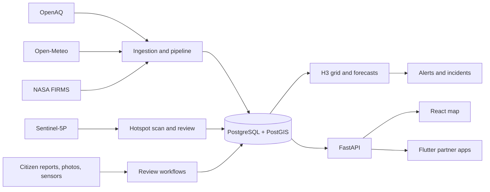

# Air Health — India Pollution Intelligence

[](https://github.com/Hima-11-works/gdg-c4c/actions/workflows/pipeline.yml)


An India-focused platform for exploring air pollution, reporting local smoke and fire, reviewing satellite hotspot candidates, and routing incidents to an authority workflow. Built for Google’s Code for Communities hackathon.

> Coverage and confidence vary by data source. A missing or unmonitored cell is shown as unknown; a hotspot candidate is a lead for review, not proof of a pollution source.

## Contents

- [What’s implemented](#whats-implemented)
- [Map and coverage](#map-and-coverage)
- [Data sources](#data-sources)
- [Scores, forecasts, and alerts](#scores-forecasts-and-alerts)
- [Architecture](#architecture)
- [Quick start](#quick-start)
- [Live data and scheduled pipeline](#live-data-and-scheduled-pipeline)
- [API and partner apps](#api-and-partner-apps)
- [Development](#development)
- [Limits and next steps](#limits-and-next-steps)
- [Repository guide](#repository-guide)

## What’s implemented

| Area | Current implementation |
|---|---|
| India pollution map | H3 grid, administrative boundaries, location search, pollutant and time controls, and multiple map detail levels. |
| Air quality | OpenAQ PM2.5 readings and Open-Meteo weather can feed the ingestion and forecast pipeline. NASA FIRMS fire observations are an optional contextual input. |
| Citizen reports and photos | People can submit geolocated fire or smoke reports with photo evidence. Reports enter a review workflow; corroborated reports can influence modeled smoke and incidents. Photo derivatives remove EXIF metadata; originals remain private. |
| Hidden hotspot leads | Recent Copernicus Sentinel-5P UV aerosol-index scans create reviewable candidates. FIRMS and air readings may add corroboration. Candidates do not identify a source or measure ground-level PM2.5. |
| Alerts and authority workflow | Rule-based air-quality alerts and reviewed incidents are available in the app workflow. A Flutter fire-department simulator can receive, assign, and update incidents. |
| Forecasting | A deterministic H3 dispersion model estimates short-range movement; an offline ridge-residual model can be evaluated and manually promoted. |
| Federation prototype | A workflow accepts local training manifests and shares fitted parameters and metrics. It is an experimental interface, not a deployed multi-agency network. |

## Map and coverage

In live mode, the national overview samples recent OpenAQ PM2.5 locations and aggregates them into coarse H3 cells. It does not represent continuous measurements across India; cells with no observed data remain unknown. Demo mode uses a separate illustrative synthetic field.

The detailed grid is currently bounded by `INGEST_BBOX_*`, set to Delhi NCR by default. The map progressively shows finer H3 cells as users zoom:

| Map level | Zoom | H3 resolution | Area requested |
|---:|---|---:|---|
| 1 | Below 6 | 3 | India overview |
| 2 | 6 to below 7 | 4 | Current viewport |
| 3 | 7 to below 9 | 5 | Current viewport |
| 4 | 9 to below 10.5 | 6 | Current viewport |
| 5 | 10.5 to 12 | 7 | Current viewport |

Ordinary map navigation stops at level 2. Search can zoom further; state views start at level 3 and district views at level 4. A selected administrative area is highlighted while outside cells are dimmed. Clearing search returns to level 2. View changes cancel obsolete cell requests so the current area can load promptly.

The layer panel switches between H3 hexagons and a smooth rendering of the same values, with optional band outlines. Map layers include current or forecast PM2.5, PDI, wind, alerts, citizen reports, and fire detections. NASA GIBS True Color and Aerosol Optical Depth imagery are optional raster overlays; Sentinel-5P NO2 tiles require a configured WMS endpoint.

## Data sources

| Source | Use | Notes |
|---|---|---|
| [OpenAQ](https://openaq.org/) | Ground PM2.5 observations | API key required for live ingestion. |
| [Open-Meteo](https://open-meteo.com/) | Weather inputs | Free forecast API; weather is sampled at coarser grid resolution. |
| [NASA FIRMS](https://firms.modaps.eosdis.nasa.gov/) | Satellite fire detections | Optional MAP key; useful as contextual corroboration. |
| [Copernicus Data Space](https://dataspace.copernicus.eu/) | Sentinel-5P aerosol-index scans | Optional refresh token; UVAI screening needs local validation. |
| [geoBoundaries](https://www.geoboundaries.org/) | India state and district boundaries | ODC-ODbL. |
| [GeoNames](https://www.geonames.org/) | Searchable place names | CC BY 4.0. |
| [Natural Earth](https://www.naturalearthdata.com/) | Coarse road context | Public domain; not live traffic or the full road network. |

See [environmental source inventory](docs/ENVIRONMENTAL_SOURCE_INVENTORY.md) for provenance, availability, and attribution details.

## Scores, forecasts, and alerts

The Pollution Development Index (PDI) is a heuristic pressure score, not a scientific measurement. It blends whichever normalized factors are available:

```text
PDI = 100 × Σ(normalized factor × weight) / Σ(abs(weight))
```

PM2.5 observations and modeled pressure from corroborated fire reports can contribute in the real pipeline. Road, industrial, and vegetation factors are extension points without live measured inputs. A vegetation sink can lower PDI; unavailable factors are omitted rather than treated as zero.

Forecasts use a deterministic, well-mixed H3 cell model for 1h, 3h, and 6h horizons. It moves and removes existing pollution according to wind and precipitation; it has no emissions or chemistry term, and current weather is held constant through the forecast.

Alerts are rule based. Current PM2.5 at or above 91 µg/m³ produces WARNING and at or above 121 µg/m³ produces CRITICAL. Forecast threshold crossings, sharp increases, and high PDI with worsening forecasts produce WATCH alerts. A cell with a recent active alert is deduplicated for the configured lookback window (24 hours by default).

## Architecture



## Quick start

Requirements: Docker Desktop with Compose, Git, and Node.js `^20.19.0 || >=22.12.0`.

1. Clone the project and enter its folder:
   ```powershell
   git clone https://github.com/Hima-11-works/gdg-c4c.git
   cd gdg-c4c
   ```
2. Create local configuration and set a private database password:
   ```powershell
   Copy-Item .env.example .env
   Copy-Item frontend/.env.example frontend/.env
   ```
   Keep credentials out of commits. For a no-key demo, set `DEMO_MODE=true` in `.env`.
3. Start PostgreSQL and the API:
   ```powershell
   docker compose up --build
   ```
   The API applies database migrations at startup. After pulling schema or
   migration changes, restart it with `docker compose restart api` so the
   startup migration step runs against the current migration files.
4. In a second terminal, create demo data and start the web map:
   ```powershell
   docker compose exec api python -m app.pipeline.run
   cd frontend
   npm ci
   npm run dev
   ```
5. Open [http://localhost:5173](http://localhost:5173). The API docs are at [http://localhost:8000/docs](http://localhost:8000/docs).

`DEMO_MODE=true` supplies deterministic synthetic inputs to the real processing pipeline so the demo can run without provider keys. Separately, `is_demo` marks an illustrative fallback response when a particular query has no stored rows.

## Live data and scheduled pipeline

To use provider data, set the applicable credentials in `.env`:

- `OPENAQ_API_KEY` for PM2.5 ingestion
- `CDSE_REFRESH_TOKEN` for Sentinel-5P hotspot scans
- `FIRMS_MAP_KEY` for NASA fire detections

Open-Meteo does not require a key for its free API. The `INGEST_BBOX_*` settings control the local ingestion area; defaults cover Delhi NCR.

The GitHub Actions workflow in `.github/workflows/pipeline.yml` runs the pipeline hourly and supports manual runs. It requires a `DATABASE_URL` GitHub secret. Provider keys are optional; the workflow defaults to demo-mode ingestion. Scheduled runs can be delayed or paused by GitHub after prolonged repository inactivity.

For all settings and defaults, see [.env.example](.env.example).

## API and partner apps

The API exposes legacy `/api/v1` routes and run-pinned `/api/v2` routes. Useful endpoints include:

- `GET /api/v2/meta`, `GET /api/v2/grid/current`, `GET /api/v2/grid/forecast`, `GET /api/v2/weather`
- `GET /api/v2/alerts`, `GET /api/v2/cells/{h3_cell}`, `GET /api/v2/exposure`
- `/api/v1` citizen reports and photo evidence, sensor submissions, hotspot scans, incidents, and raster tiles
- `/health`, `/health/ready`, `/docs`

See the [API index](docs/api/README.md) and focused contracts for [hotspots](docs/api/hotspots.md), [citizen reports](docs/api/citizen-reports.md), [photo evidence](docs/api/citizen-photos.md), [sensor readings](docs/api/citizen-sensor-readings.md), [incidents](docs/api/incidents.md), and [federation](docs/api/federation.md).

- `partner_apps/air_health_flutter/` — citizen reporting app. See its [README](partner_apps/air_health_flutter/README.md).
- `partner_apps/fire_dept_simulator/` — incident assignment and response simulator. Alerts are delivered inside the app while it is active or after refresh/resume. It does not send remote push, SMS, email, or emergency dispatch.

## Development

Backend (Python 3.11+):

```bash
cd backend
python -m venv .venv
# Activate the virtual environment for your shell, then:
pip install -e ".[dev]"
alembic upgrade head
pytest
ruff check .
```

Frontend:

```bash
cd frontend
npm ci
npm run build
npm run lint
```

Flutter apps (run from each app directory):

```bash
flutter pub get
flutter analyze
flutter test
```

For database integration tests, configure a test PostgreSQL/PostGIS database and run `RUN_DB_TESTS=1 pytest` from `backend/`.

## Limits and next steps

- The national view samples available stations; the detailed live grid defaults to Delhi NCR. Countrywide, continuous sensor coverage is not present.
- Sentinel-5P UV aerosol index is a screening signal, not a calibrated pollution probability or ground-level PM2.5 measurement. Review and local validation are needed before intervention.
- Forecasts use a simplified deterministic cell model with limited meteorological inputs; they are not atmospheric chemistry predictions.
- The Pollution Development Index is heuristic. Several factors, including road, industrial, and vegetation data, do not yet have live measured inputs.
- Alert rules are threshold-based. The ridge-residual model is an offline evaluation and manual-promotion path, not an automatically trained production model.
- Citizen reports and sensor submissions require review. Uploaded image derivatives remove metadata, but no malware-scanning service is configured.
- Authority incidents and the fire-department app demonstrate an in-app workflow. No real agency integration or remote notification channel is configured.
- Federation is a prototype; no agencies are enrolled, and there is no differential privacy or independently verified participant identity.
- Provider credentials, scheduled database configuration, deployment secrets, and ongoing source validation are required for a live service.

Further calibration and operational requirements are in [model evaluation](docs/M3_MODEL_AND_EVALUATION.md), [operations](docs/M6_OPERATIONS.md), and the [current go-live checklist](docs/GO_LIVE.md). The [deployment plan](docs/DEPLOYMENT_PLAN.md) is a historical implementation record.

## Repository guide

```text
backend/                 FastAPI service, data pipeline, migrations, tests
frontend/                React + MapLibre web application
partner_apps/            Flutter citizen and fire-department apps
docs/api/                API contracts
docs/                    Architecture, source inventory, operations, plans
scripts/                 Bootstrap and development utilities
```

Additional references: [architecture](docs/architecture.md), [implementation scope](docs/IMPLEMENTATION_SCOPE.md), [model and evaluation](docs/M3_MODEL_AND_EVALUATION.md), and [operational guide](docs/M6_OPERATIONS.md).
