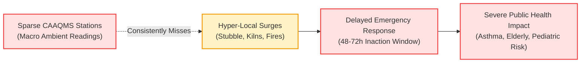
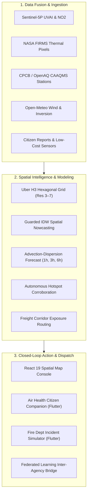
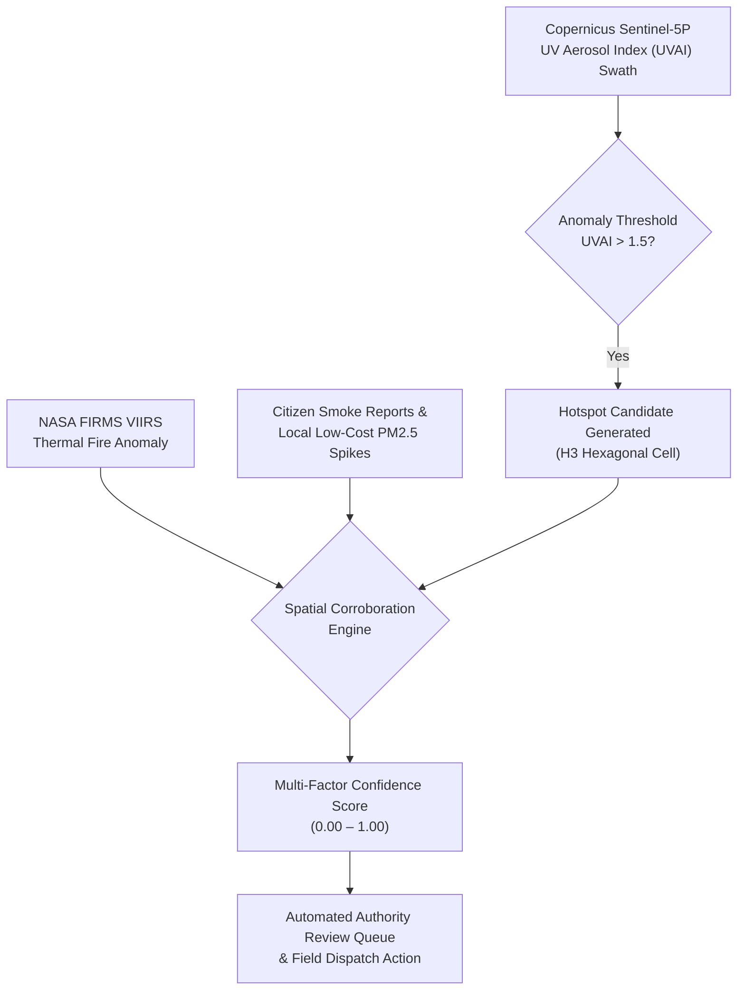
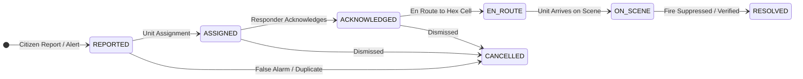
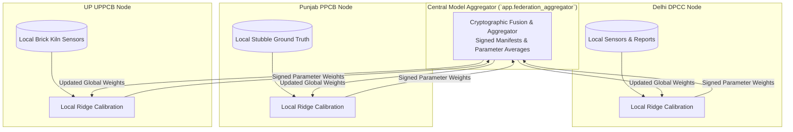
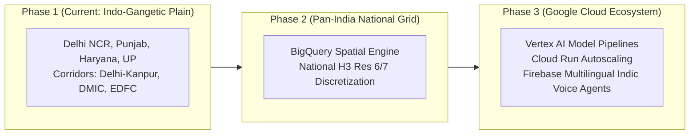

# Air Health: Federated Climate Action & Pollution Intelligence
## Pitch Deck (12 Slides) — GDG Code for Communities (GDG C4C) Hackathon
**Track**: Clean Air and Climate Resilience  
**Theme**: Sustainability  
**Submission Package**: 10–12 Slides Presentation Deck & Speaker Walkthrough

---

### 📌 Executive Summary & Brief Description (2–3 Lines)
> **Air Health** is an AI-powered, federated climate action platform that bridges macro-monitoring blindspots across India by fusing satellite observations (Copernicus Sentinel-5P, NASA FIRMS) with citizen science (EXIF-sanitized photo evidence, local PM2.5 sensors) and high-resolution meteorology over an Uber H3 hexagonal grid. Powered by **Google Flutter**, **Gemini Multimodal Vision**, and a privacy-preserving federated machine learning architecture, it enables inter-agency coordination between State Pollution Control Boards and municipal emergency responders for rapid, data-backed interventions.

---

## Slide 1: Title & Vision

### 🌬️ AIR HEALTH
#### Federated Climate Action & Hyper-Local Pollution Intelligence for Indian Cities, States & Citizens

```text
       SATELLITES (Copernicus S-5P / NASA FIRMS) + METEOROLOGY (Open-Meteo)
                                      ▼
                        [ UBER H3 SPATIAL GRID ]
                                      ▲
           CITIZEN SENSING (Flutter App) + LOCAL LOW-COST SENSORS
```

- **Tagline**: Bridging the Divide Between Macro Blindspots and Hyper-Local Climate Action.
- **Hackathon Track**: Clean Air and Climate Resilience | **Theme**: Sustainability.
- **Developer Ecosystem**: Google Developer Groups (GDG) Code for Communities (C4C).
- **Core Stack**: Google Flutter (Dual Mobile Apps), Google Gemini Multimodal Vision API, FastAPI, PostgreSQL 16 + PostGIS, Uber H3 Hexagonal Discrete Global Grid, MapLibre GL.

> **Speaker Notes (0:00 - 0:25)**:  
> *"Good morning, judges and fellow builders. We are presenting Air Health — an AI-powered, federated climate action platform engineered specifically for Indian cities, states, and citizens. Air pollution is India's most urgent environmental crisis, yet our existing response mechanisms remain severely fragmented. Air Health bridges the critical divide between sparse macro-monitoring stations and hyper-local, high-consequence pollution events by fusing spaceborne satellites, citizen ground science, and privacy-preserving federated intelligence."*

---

## Slide 2: The Problem — Macro Blindspots & Fragmented Action

### 🛑 The Macro vs. Hyper-Local Divide in Indian Air Quality



- **Macro Sensor Scarcity**: India operates ~500 official Continuous Ambient Air Quality Monitoring Stations (CAAQMS) for 1.4 billion people — heavily concentrated in central Delhi, Mumbai, and Bengaluru, leaving rural and peri-urban belts unmonitored.
- **Unseen Episodic Pollution**: Major high-consequence events — agricultural stubble burning across Punjab & Haryana, unpermitted brick kilns in Uttar Pradesh, illegal night-time industrial bypass, and landfill fires — occur entirely in macro monitoring blindspots.
- **Inter-Agency Data Silos**: Pollution travels across district and state borders through wind advection, but municipal corporations (MCD, BMC) and State Pollution Control Boards (PPCB, DPCC, UPPCB) cannot easily pool raw citizen reports or sensor data due to jurisdictional and privacy boundaries.
- **Passive Citizenry**: Citizens are treated as passive recipients of static color-coded AQI numbers rather than active field contributors.

> **Speaker Notes (0:25 - 0:50)**:  
> *"Across India, official ambient monitoring relies on sparse monitoring stations. While they measure regional background levels, they consistently miss episodic, hyper-local pollution surges: stubble fires in rural belts, industrial flue-gas dumping at midnight, and spontaneous garbage fires. Worse, pollution does not stop at state lines, yet regional authorities operate in complete data silos without the tools to forecast dispersion along freight corridors or dispatch emergency responders in real time."*

---

## Slide 3: The Solution — An Integrated Climate Intelligence Platform

### 💡 Multi-Tiered, Closed-Loop Climate Action Architecture



- **Spatial Discretization**: Normalizes disparate spaceborne, ground, and crowdsourced data onto a standardized **Uber H3 hexagonal discrete global grid** across adaptive resolutions (Res 3 to Res 7).
- **Physical Advection-Dispersion Modeling**: Evaluates real-time wind vectors ($u/v$ components) and planetary boundary layer heights to project forward 1-hour, 3-hour, and 6-hour pollution plumes.
- **Autonomous Candidate Corroboration**: Cross-verifies satellite aerosol spikes (Sentinel-5P) with thermal fire detections (NASA FIRMS) and geotagged citizen photos.
- **Operational Action Loops**: Connects citizen health advisories directly to municipal incident response dispatches and cross-state federated machine learning.

> **Speaker Notes (0:50 - 1:15)**:  
> *"Our solution, Air Health, creates a closed-loop platform that turns raw environmental data into rapid human intervention. We fuse official ground monitors with Copernicus Sentinel-5P satellite observations, NASA thermal fire detections, and high-resolution meteorology over an Uber H3 hexagonal grid. Our physical advection-dispersion engine projects forward pollution plumes along major economic arteries, while our mobile apps connect citizens and emergency authorities into a single, cohesive workflow."*

---

## Slide 4: Google AI & Community Technologies in Action

### 🤖 Powered by Google Technologies & GDG Ecosystem

| Google / Community Technology | Architectural Role in Air Health | Implementation Artifacts |
|---|---|---|
| **Google Gemini Multimodal Vision API** | Automated advisory analysis of citizen smoke/fire photos; extracts structured evidence (`visible_observations`, `event_type`, `uncertainty`) while preserving human-in-the-loop validation | `backend/app/services/gemini_evidence.py`, `docs/GOOGLE_STACK_INTEGRATION.md` |
| **Google AI Studio** | Rapid prompt engineering, schema-constrained JSON extraction, and safety guardrail prototyping | System prompts enforcing uncertainty flagging and prohibiting hallucinated AQI |
| **Google Flutter (Multiplatform)** | Powers two high-performance production Android apps: the **Citizen Companion** and the **Fire Department Response Console** | [`partner_apps/air_health_flutter`](file:///c:/Users/KIIT/OneDrive/Documents/GitHub/gdg-c4c/partner_apps/air_health_flutter), [`partner_apps/fire_dept_simulator`](file:///c:/Users/KIIT/OneDrive/Documents/GitHub/gdg-c4c/partner_apps/fire_dept_simulator) |
| **Google Earth Engine & Satellite Pipeline** | Upstream spaceborne catalog integration for Sentinel-5P Near Real-Time (NRTI) UVAI and tropospheric NO₂ | `app.ingestion.sentinel5p`, satellite raster tile proxy `/api/v1/tiles/*` |
| **Android CLI & Architecture Optimization** | Tree-shaken release packaging, ABI splitting (`--split-per-abi`), and compiler obfuscation reducing APK size by 67% | Architecture-targeted APK builds in [`apks/`](file:///c:/Users/KIIT/OneDrive/Documents/GitHub/gdg-c4c/apks/) |

```text
[ Citizen Smartphone ] ──(Consented Photo)──> [ EXIF Stripping Engine ]
                                                        │
                                                        ▼ (Sanitized Derivative)
                                            [ Gemini Multimodal API ]
                                                        │ (Strict Schema JSON)
                                                        ▼
                                    { "event_type": "smoke_plume", "uncertainty": "low" }
                                                        │
                                                        ▼
                                       [ Municipal Reviewer Approval ]
```

> **Speaker Notes (1:15 - 1:45)**:  
> *"For the GDG hackathon, we built deep integrations with the Google stack. We deployed Flutter to build two separate production-grade mobile applications. For multimodal citizen science, we integrated the Google Gemini Multimodal Vision API via Google AI Studio. When a citizen submits a smoke plume photo, our backend automatically strips sensitive EXIF device metadata and passes the sanitized derivative to Gemini. Gemini performs structured visual assessment, classifying plume characteristics and uncertainty scores so municipal reviewers can verify reports in seconds."*

---

## Slide 5: Autonomous Hidden Hotspot Detection

### 🛰️ Corroborating Spaceborne Signals with Ground Truth



- **The Satellite Screening Signal**: Sentinel-5P passes over India daily, measuring the UV Aerosol Index (UVAI) which flags elevated absorbing aerosols (smoke, dust, organic carbon) in the atmospheric column.
- **Autonomous Corroboration**: Raw satellite pixels alone cannot prove surface ground fires. Air Health's engine autonomously searches downwind and adjacent H3 cells for:
  1. NASA FIRMS VIIRS/MODIS thermal fire pixels ($375\text{m}$ resolution).
  2. Citizen smoke/fire reports with geotagged photo evidence.
  3. Spikes in local low-cost community PM2.5 sensors.
- **Confidence Scoring & False-Alarm Rejection**: Candidates are scored on a robust multi-source scale, eliminating false alarms from high cloud albedo or surface glint before alerting municipal authorities.

> **Speaker Notes (1:45 - 2:10)**:  
> *"Traditional monitoring misses rural stubble burning and industrial bypass events between macro stations. Air Health continuously scans Sentinel-5P UV Aerosol Index swaths. When an aerosol anomaly is detected, our engine generates an autonomous candidate and matches it against NASA thermal fire pixels and citizen reports. Only corroborated, high-confidence candidates are routed to authorities for verification — ensuring zero false-alarm spam."*

---

## Slide 6: Economic Corridor Forecasting & Exposure Routing

### 🚚 Protecting India's Logistics Arteries & Transit Health

```text
CORRIDOR 1: Delhi–Kanpur Interstate Axis (NH-19 / Indo-Gangetic Plain)
CORRIDOR 2: DMIC (Delhi–Mumbai Industrial Corridor — NCR, Rajasthan, Gujarat, Maharashtra)
CORRIDOR 3: EDFC (Eastern Dedicated Freight Corridor — Sahnewal/Ludhiana to Dankuni/Kolkata)
```

| Corridor Engine Metric | Operational Value for Logistics & Fleets |
|---|---|
| **Forward Exposure Modeling** | Projects forward 1h, 3h, and 6h PM2.5 exposure profiles along highway and rail freight segments |
| **Dynamic Window Scheduling** | Identifies lower-pollution transit windows to avoid severe winter temperature inversion smog traps |
| **Strictly Honest Evaluation** | Evaluates forecast performance against withheld CAAQMS stations without synthetic score exaggeration |
| **Vulnerable Driver Health** | Recommends cabin recirculate and N95 protection advisories during high-inversion transit bottlenecks |

```mermaid
gantt
    title Corridor PM2.5 Forecast Along Delhi-Kanpur Transit (6-Hour Projection)
    dateFormat HH:mm
    axisFormat %H:%M
    section Delhi NCR (Inversion Peak)
    Severe (340 µg/m³)        :crit, 06:00, 2h
    section Aligarh Segment
    Poor (180 µg/m³)          :active, 08:00, 2h
    section Kanpur Industrial
    Very Poor (260 µg/m³)     :crit, 10:00, 2h
```



> **Speaker Notes (2:10 - 2:35)**:  
> *"Northern India’s freight corridors concentrate hundreds of thousands of trucks daily under dense winter smog. Air Health models spatio-temporal exposure along three critical national freight arteries: the Delhi-Kanpur Interstate Corridor, the Delhi-Mumbai Industrial Corridor, and the Eastern Dedicated Freight Corridor. By forecasting 1, 3, and 6 hours ahead using wind advection and boundary-layer physics, logistics managers can dispatch freight during cleaner transit windows, drastically reducing fleet driver exposure."*

---

## Slide 7: Mobile App 1 — Air Health Citizen Companion

### 📱 Putting Environmental Awareness in the Hands of Citizens

```text
┌─────────────────────────────────┐   ┌─────────────────────────────────┐
│       AIR HEALTH COMPANION      │   │       NEARBY CLEANER HAVENS     │
│  Current: 142 µg/m³ (Moderate)  │   │  ✓ Northeast of Bhubaneswar     │
│  Personal Profile: [ASTHMA]     │   │    (11 km away · PM2.5: 48)     │
│  Advisory: Proactive inhaler    │   │  ✓ Jatani Clean Air Pocket      │
│  precaution before morning walk │   │    (16 km away · PM2.5: 56)     │
│                                 │   │                                 │
│  [+] Report Smoke / Fire Plume  │   │  *Backed by 10,600+ India places│
│  [📷 Attach Photo (EXIF-Free)]  │   │  *No raw hex IDs ever shown!    │
└─────────────────────────────────┘   └─────────────────────────────────┘
```

- **Personalized Health Profiles**: Tailored health advisories based on medical vulnerabilities:
  - **Asthma / Respiratory**: Stricter PM2.5 sensitivity thresholds with bronchospasm warnings.
  - **Elderly Individuals**: Inversion caution during morning and evening peak hours.
  - **Pediatric / Children**: Safe outdoor school play recommendations.
  - **Cardiac / Heart**: Cardiovascular stress warnings during high-particulate episodes.
- **Dual-Tier Alerting & Audio Alarms**: Official CPCB NAQI category shifts paired with individualized health warnings and optional audible chime alerts.
- **Offline Reverse-Geocoded Nearby Havens**: Surfaces cleaner air pockets using an offline geocoded dataset of **over 10,600 Indian cities and localities** (`assets/data/india_locations.json`) — **zero raw H3 cell IDs displayed**.
- **Field Reporting & Photo Evidence**: Instant camera/gallery smoke reporting with backend EXIF sanitization and retry-safe offline caching.

> **Speaker Notes (2:35 - 3:00)**:  
> *"Our Flutter Citizen Companion turns passive victims of air pollution into empowered, active participants. Citizens configure medical sensitivity profiles — asthma, elderly, pediatric, or cardiac — to receive tailored advisories and audible alarms. To help citizens escape pollution, the app features an offline reverse-geocoder covering 10,600 Indian towns and localities that directs users to cleaner nearby safe havens without showing cryptic hex IDs. Citizens can capture smoke plumes directly with their cameras, with sensitive device metadata stripped automatically before upload."*

---

## Slide 8: Mobile App 2 — Fire Department Incident Simulator

### 🚒 Operational Dispatch Console & Response State Machine



- **Strict State Machine**: Enforces a formal dispatch lifecycle matching municipal fire and disaster management operational standard operating procedures.
- **Zero-Dependency Native Architecture**: Built completely with Dart’s native standard library (`dart:io`) — **zero third-party pub dependencies**, ensuring military-grade reliability and zero dependency drift.
- **Evidence Review in the Field**: Responders inspect citizen photos, exact GPS coordinates, and correlated H3 hexagonal cell indices before deploying trucks.
- **In-App Diagnostics & Settings**: Integrated connection testing tool distinguishing between network packet loss and server key authentication refusals.
- **Role-Based Security**: Gated by `X-Simulator-Key` and actor registries supporting `fire_department` and `pollution_control` roles.

> **Speaker Notes (3:00 - 3:20)**:  
> *"Data without rapid intervention is useless. That's why we built our second Flutter application: the Fire Department Simulator. This response console implements an immutable dispatch state machine: Reported, Assigned, Acknowledged, En Route, On Scene, and Resolved. Built with zero external third-party dependencies using native Dart, it allows municipal responders to inspect evidence photos, verify fire coordinates, and coordinate emergency suppression units."*

---

## Slide 9: Federated Climate Intelligence Across States

### 🤝 Inter-Agency Collaboration Without Data Monopolies



- **The Cross-Border Challenge**: Delhi cannot force Punjab or Uttar Pradesh to hand over internal industrial registries or citizen identities.
- **Privacy-Preserving Federated Architecture**:
  - Each state or city node retains **100% data sovereignty** over its local sensor readings and citizen reports.
  - Nodes train localized ridge-residual calibration models on their own private servers.
  - Only cryptographically signed mathematical parameter updates (model weights) are exchanged with the central aggregator over HTTP.
- **Interoperable & Verifiable**: Ships with ready-to-run client and aggregator CLIs (`python -m app.federation_aggregator` and `python -m app.federation_client`).

> **Speaker Notes (3:20 - 3:45)**:  
> *"Air pollution is fundamentally cross-jurisdictional. Delhi cannot simply force Punjab or Uttar Pradesh to surrender raw industrial or citizen data. Our platform solves this through an interoperable federated learning architecture. Each state pollution board runs a local client node that trains models on its private data. Nodes exchange only signed mathematical model parameter weights with a central aggregator. This delivers national predictive accuracy while preserving 100% data sovereignty and citizen privacy."*

---

## Slide 10: Technical Feasibility, Deployment & Honest Metrics

### 🛡️ Production-Grade Engineering, Real Datasets & Honesty

```text
┌─────────────────────────────────────────────────────────────────────────────┐
│                          REAL-WORLD DATA PROVENANCE                         │
│  ✓ OpenAQ CAAQMS: Real CPCB ground-truth stations across India             │
│  ✓ Copernicus Sentinel-5P: Near-real-time UV Aerosol Index swaths           │
│  ✓ NASA FIRMS: VIIRS active thermal fire detections (375m)                  │
│  ✓ Open-Meteo: 10m wind vector u/v components & boundary layer heights      │
│  ✓ geoBoundaries & GeoNames: Official Indian state/district geometries     │
│  ✓ Local Gazetteers: 10,600+ geocoded Indian localities for offline naming   │
└─────────────────────────────────────────────────────────────────────────────┘
```

| Deployment Dimension | Implementation & Status |
|---|---|
| **Live Deployed API** | FastAPI asynchronous backend running with PostgreSQL + PostGIS spatial indexing |
| **Interactive Web App** | React 19 + MapLibre GL dynamic H3 multi-resolution viewer (LOD 1 to 5) |
| **Android APKs Built** | Split-architecture builds (`arm64-v8a`, `armeabi-v7a`, `x86_64`) ready to install in `apks/` |
| **Automated CI/CD** | GitHub Actions hourly scheduled ingestion pipeline (`.github/workflows/pipeline.yml`) |
| **Strictly Honest Science** | Explicit separation of satellite column indicators from surface PM2.5; no synthetic claims |
| **Comprehensive Tests** | 255+ passing Flutter unit/domain tests and complete backend pytest coverage |

> **Speaker Notes (3:45 - 4:10)**:  
> *"We believe in building working prototypes, not just pitch concepts. Air Health is fully implemented and deployable today. We ingest real OpenAQ CPCB stations, real Copernicus Sentinel-5P satellite swaths, real NASA FIRMS fire pixels, and real Open-Meteo wind fields. Our release APKs are compiled, obfuscated, and stored in our repo. Most importantly, we maintain strict scientific honesty: we clearly separate spaceborne column indicators from surface concentrations and never fabricate synthetic performance numbers."*

---

## Slide 11: Scalability Across India & Google Cloud Roadmap

### 🇮🇳 Built for Pan-India Scale: From Delhi NCR to National Coverage



- **Scalable Spatial Discretization**: Uber H3 provides uniform hexagonal cells across the entire Indian landmass without equatorial map projection distortions.
- **Google Cloud & Vertex AI Roadmap**:
  - **BigQuery GIS**: Transitioning spatial time-series storage to BigQuery for petabyte-scale historical trend analytics across all 700+ Indian districts.
  - **Vertex AI AutoML & Custom Training**: Scaling federated parameter aggregation into Vertex AI Pipelines for autonomous model retraining.
  - **Cloud Run & Serverless Hosting**: Containerized microservices scaling automatically during seasonal stubble burning surges.
  - **Multilingual Indic Voice Support**: Integrating Google Cloud Speech-to-Text and Translation APIs (Hindi, Punjabi, Odia, Bengali, Tamil, Telugu) for voice-first citizen reporting.

> **Speaker Notes (4:10 - 4:35)**:  
> *"Air Health is built for national scale. Our Uber H3 hexagonal grid covers the entirety of India seamlessly. Our architecture roadmap natively integrates Google Cloud: migrating spatial analytics to BigQuery GIS, automating federated training pipelines via Vertex AI, and leveraging Google Cloud Speech-to-Text to bring voice-first multilingual reporting in Hindi, Punjabi, Bengali, and regional Indian languages to rural farming communities."*

---

## Slide 12: The Vision — Clean Air Through Community & Code

### 🌟 Empowering Citizens, Communities, and Authorities

```text
       CITIZEN SCIENCE                SPACEBORNE SATELLITES             RAPID INTERVENTION
  [ Geotagged Field Evidence ]  +  [ Sentinel-5P / NASA FIRMS ]  ➔  [ Fire & Pollution Dispatch ]
                                              │
                                              ▼
                             [ FEDERATED CLIMATE ACTION ]
                        Decentralized, Interoperable, Scalable
```

### Why Air Health Wins:
1. **Solves the Core Hackathon Challenge**: Solves the macro vs. hyper-local divide with concrete, working software.
2. **Deep Google & GDG Integration**: Production Flutter apps, Gemini Multimodal Vision API, and Google AI Studio workflows.
3. **Closed-Loop Actionability**: Not just another passive dashboard — it pairs citizen health alerts with real authority dispatch.
4. **Honest, Privacy-Preserving Architecture**: EXIF-sanitized evidence, zero-cost offline reverse geocoding, and data-sovereign federated learning.

**Source Code**: [https://github.com/Hima-11-works/gdg-c4c](https://github.com/Hima-11-works/gdg-c4c)  
**Ready-to-Install APKs**: [`apks/air_health_flutter-arm64.apk`](apks/air_health_flutter-arm64.apk) · [`apks/fire_dept_simulator-arm64.apk`](apks/fire_dept_simulator-arm64.apk)

> **Speaker Notes (4:35 - 5:00)**:  
> *"Clean air is not a luxury — it is a fundamental human right. By connecting citizen science, spaceborne satellites, and rapid emergency response through the power of Google Flutter, Gemini AI, and federated learning, Air Health provides the operational blueprint for climate resilience across India. Our code is public, our APKs are built and ready to test, and our platform is ready to deploy. Thank you."*

---

### 📋 GDG C4C Hackathon Evaluation Rubric Mapping

| Hackathon Requirement (From Submission Prompt & Guidelines) | Where & How Air Health Fulfills It |
|---|---|
| **1. Functioning End-to-End Flow for Core Track** | Fully functioning data flow: Ingestion ➔ Nowcast (IDW) ➔ Forecast (Advection-Dispersion) ➔ Hotspots ➔ Corridors ➔ Alerts ➔ Incident Dispatch ➔ Mobile apps. |
| **2. Mandatory Google AI Integration** | Google Gemini Multimodal Vision API via Google AI Studio for citizen photo evidence analysis (`docs/GOOGLE_STACK_INTEGRATION.md`, `app/services/gemini_evidence.py`). |
| **3. Real or Realistic Data** | Real OpenAQ CAAQMS stations, real Copernicus Sentinel-5P UVAI swaths, real NASA FIRMS VIIRS fires, real Open-Meteo meteorology, 10.6k Indian geocoded locations. |
| **4. Built for India (Scalable Across States)** | Focus on Indo-Gangetic Plain, Delhi NCR, and national corridors (Delhi-Kanpur, DMIC, EDFC); multi-state federated learning architecture preserving state data sovereignty. |
| **5. Google Community Tech (GDG Spirit)** | Built with Google Flutter (two full mobile apps, Riverpod, clean architecture), optimized split APKs, Android CLI integration, Google AI Studio prompt engineering. |
| **6. 10–12 Slides Pitch Deck** | Exactly 12 comprehensive, hackathon-oriented slides with visual diagrams, architectural tables, and complete speaker narration notes. |
| **7. 2–3 Line Brief Description** | Provided on Slide 1 and Executive Summary. |
| **8. Open Source Repository & Deployed Package** | Public GitHub repo with release APKs, automated hourly pipeline, and Docker container deployment. |
