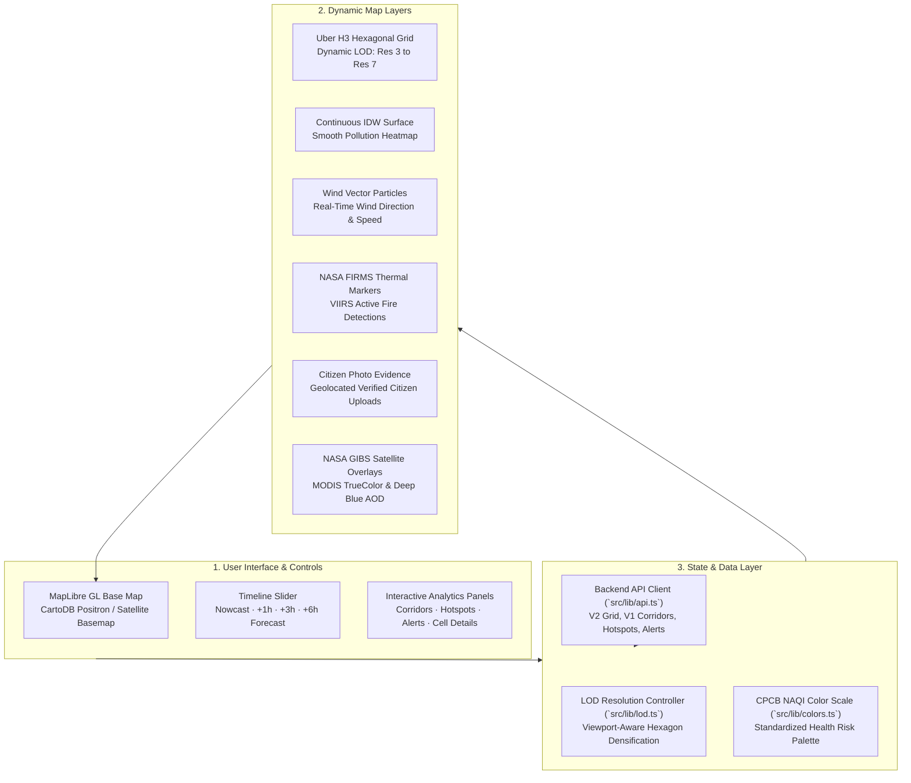

# Air Health — Interactive Web Map & Climate Action Console

[](https://react.dev/)
[](https://www.typescriptlang.org/)
[](https://vitejs.dev/)
[](https://maplibre.org/)
[](https://tailwindcss.com/)

The **Air Health Frontend** is an operational, interactive web dashboard designed for environmental authorities, urban planners, logistics coordinators, and the public. It visualizes multi-resolution Uber H3 hexagonal air quality grids, continuous IDW pollution heat surfaces, forward advection forecasts, satellite fire anomalies, economic freight corridors, and citizen-reported ground evidence.

---

## 🏛️ Visual Architecture & Layers



---

## 🚀 Key Features

### 1. Dynamic Hexagonal Grid (Uber H3 LOD)
The viewport automatically adjusts its spatial granularity based on user zoom level:
- **Res 3 (~110 km)**: National overview across India.
- **Res 4 (~41 km)**: Regional / Interstate level.
- **Res 5 (~16 km)**: State-level and industrial corridor focus.
- **Res 6 (~6 km)**: District and Municipal Corporation boundary analysis.
- **Res 7 (~2.2 km)**: Ward and hyper-local neighborhood resolution.

### 2. Multi-Layer Environmental Visualization
- **Discrete vs Continuous**: Toggle between structured H3 hexagons and seamless Inverse Distance Weighting (IDW) heat surfaces.
- **Wind Vector Dynamics**: Real-time animated particle trails driven by Open-Meteo $u/v$ wind components.
- **NASA FIRMS Fires**: Visual fire anomaly markers highlighting active agricultural stubble burning and industrial flares.
- **NASA GIBS WMS Satellite Overlays**: Live TrueColor surface imagery and Aerosol Optical Depth (AOD) layers proxied through the backend.

### 3. Economic Corridor Exposure Analyzer
- Interactive route inspection for high-priority economic axes:
  - **Delhi–Kanpur Interstate Corridor** (Indo-Gangetic Plain axis).
  - **DMIC** (Delhi–Mumbai Industrial Corridor).
  - **EDFC** (Eastern Dedicated Freight Corridor).
- Forward 1-hour, 3-hour, and 6-hour exposure charts enabling logistics managers to route freight during lower-pollution windows.

### 4. Hidden Hotspot Review Console
- Corroborates satellite aerosol anomalies (Copernicus Sentinel-5P UVAI) against NASA FIRMS fire pixels and local citizen smoke reports.
- Allows authority reviewers to inspect candidate confidence scores and coordinate dispatch.

### 5. Citizen Photo Evidence Inspection
- Interactive map markers showing citizen-reported smoke and fire plumes.
- Inspect sanitized photo evidence with privacy-preserving metadata stripping verified on the backend.

---

## 🛠️ Project Structure

```text
frontend/
├── public/                 # Static assets, fallback boundary data, Indian locations
│   └── data/               # GeoJSON boundaries & Indian place database
├── src/
│   ├── components/         # React UI and map components
│   │   ├── MapView.tsx     # MapLibre GL map instance and layer rendering
│   │   ├── CorridorPanel.tsx # Economic corridor routing and time-series charts
│   │   ├── HotspotPanel.tsx # Satellite candidate hotspot inspection drawer
│   │   ├── TimelineSlider.tsx # Interactive forecast horizon scrubber
│   │   ├── AlertBanner.tsx # NAQI warning and critical alert banner
│   │   └── LayerToggle.tsx # Layer visibility and satellite overlay switch
│   ├── lib/                # Utilities and core algorithms
│   │   ├── api.ts          # Strongly-typed backend API client
│   │   ├── lod.ts          # Viewport zoom to H3 resolution mapping
│   │   ├── colors.ts       # CPCB NAQI color scale definitions
│   │   └── types.ts        # TypeScript data contracts
│   ├── App.tsx             # Root dashboard layout and panel composition
│   └── main.tsx            # Application entry point
├── package.json
└── vite.config.ts          # Vite build and proxy configuration
```

---

## ⚡ Getting Started

### Prerequisites
- **Node.js**: `^20.19.0` or `>=22.12.0`
- **npm**: `>=10.0.0`

### Installation & Run

1. **Install dependencies:**
   ```bash
   cd frontend
   npm ci
   ```

2. **Configure environment:**
   ```powershell
   Copy-Item .env.example .env
   ```
   Set your API target in `.env`:
   ```env
   VITE_API_BASE_URL=http://localhost:8000
   ```

3. **Start development server:**
   ```bash
   npm run dev
   ```
   Open [http://localhost:5173](http://localhost:5173) in your browser.

---

## 📜 Available Scripts

| Command | Action |
|---|---|
| `npm run dev` | Starts Vite local development server at `http://localhost:5173` |
| `npm run build` | Runs TypeScript compilation and generates production bundle in `dist/` |
| `npm run preview` | Previews the production build locally |
| `npm run lint` | Runs `oxlint` fast linter across source files |
| `npm run format` | Formats code with `prettier` |
