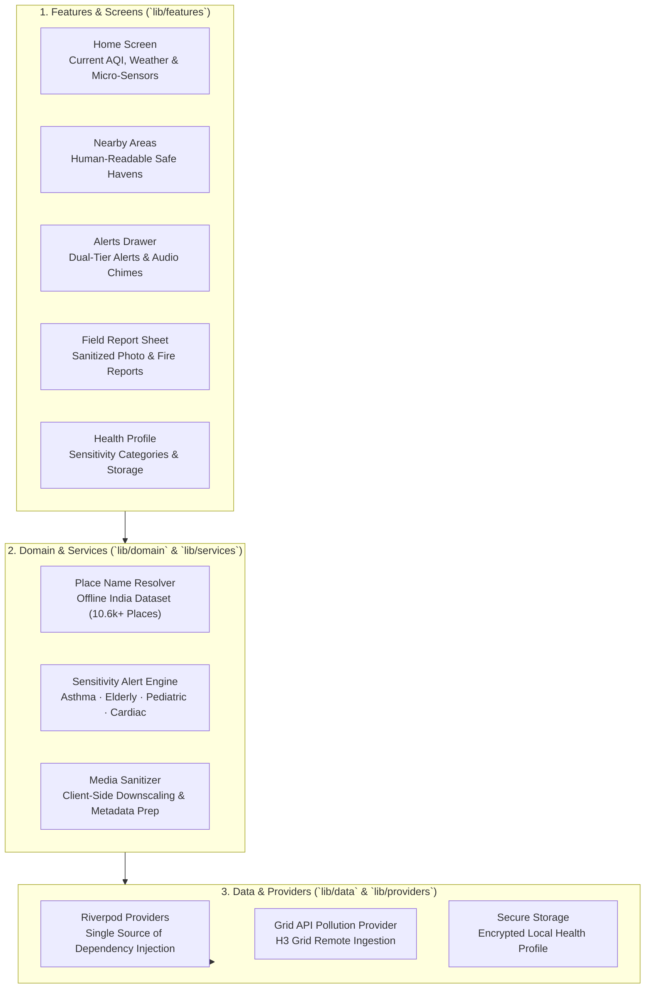

# Air Health Companion — Citizen Mobile Application

[](https://flutter.dev/)
[](https://dart.dev/)
[](https://riverpod.dev/)
[](https://opensource.org/licenses/MIT)

A Flutter mobile health companion designed for citizens to track personal air quality exposure, receive personalized health advisories, discover lower-pollution nearby areas, report smoke/fire plumes with photo evidence, and contribute low-cost community sensor readings.

> **Health Advisory Notice**: This app provides environmental exposure awareness based on official **Central Pollution Control Board (CPCB) NAQI** standards. It is not a clinical diagnostic or medical emergency service.

---

## 🏛️ Architecture & App Structure



---

## 🚀 Key Features

### 1. Personalized Health Sensitivity Profiles
Citizens can configure individual sensitivity profiles for tailored environmental advisories:
- **Asthma / Respiratory Conditions**: Stricter PM2.5 thresholds with proactive bronchospasm warnings.
- **Elderly Individuals**: Enhanced caution during sustained morning and evening inversions.
- **Pediatric / Children**: Safe outdoor play recommendations based on hourly forecasts.
- **Cardiac / Heart Conditions**: Critical cardiovascular stress alerts during severe smog spikes.

### 2. Dual-Tier Alerting & Audio Alarms
- **Tier 1 (Community)**: Official CPCB NAQI category shifts (Satisfactory, Moderate, Poor, Very Poor, Severe).
- **Tier 2 (Personalized)**: Vulnerability-matched medical warnings.
- **Audible Alerts**: Optional high-priority audio chime alerting users during dangerous pollution surges.

### 3. Human-Readable Nearby Safe Havens
- The **Nearby** tab automatically surfaces cleaner air areas within a 25 km radius.
- Backed by an offline geocoded dataset of **over 10,600 Indian cities, towns, and localities** (`assets/data/india_locations.json`) with instant embedded offline seeds (Bhubaneswar, Cuttack, Delhi, Noida, Mumbai, Bengaluru, etc.).
- **Zero raw H3 cell IDs**: Hexagonal cell IDs are transparently reverse-geocoded into intuitive location names and compass directions (e.g. *"Northeast of Bhubaneswar"*, *"Jatani Area"*).

### 4. Ground-Truth Field Reporting (Smoke & Fire)
- Citizens can photograph and report localized pollution events (agricultural burning, garbage fires, industrial bypass).
- **Privacy First**: Sensitive EXIF metadata (camera serial, exact device info) is automatically stripped on the backend, and rasters are re-encoded before review.
- **Retry Resilience**: If network drops after report creation, the app retains the report ID allowing one-tap photo upload retry without creating duplicates.

### 5. Community Low-Cost Sensor Ingestion
- Citizens and community centers can manually or automatically submit low-cost PM2.5 sensor readings (e.g., Plantower, Sensirion) to the municipal authority review queue.

---

## 📂 Project Layout

```text
lib/
├── app/                  # MaterialApp configuration, router initialization, theme
├── core/                 # Result types, date formatters, math utilities
├── domain/               # Pure Dart domain models, CPCB color scales, sensitivity rules
├── data/                 # Remote API providers, DTOs, and report repositories
├── services/             # PlaceNameResolver (offline reverse-geocoder), audio alerts
├── providers/            # Riverpod dependency injection wiring
├── features/             # Feature UI modules:
│   ├── home/             # Primary AQI dial, weather card, sensor input
│   ├── nearby/           # Nearby cleaner air areas with resolved place names
│   ├── alerts/           # Alert notification history and sensitivity advisories
│   ├── profile/          # User health profile configuration
│   ├── reports/          # Smoke/fire field reporting sheet with photo attachment
│   └── onboarding/       # First-time health profile onboarding walkthrough
├── routing/              # Declarative go_router route configuration
├── theme/                # Design tokens, typography, and CPCB standard colors
└── storage/              # flutter_secure_storage and shared_preferences persistence
```

---

## 📱 Pre-Built Release APKs

Ready-to-install Android release APKs are available directly in [`apks/`](../../apks/):

| Target Architecture | File Name | Size | Recommended For |
|---|---|---|---|
| **ARM 64-bit** | [`air_health_flutter-arm64.apk`](../../apks/air_health_flutter-arm64.apk) | **~19.1 MB** | **Modern Android phones** (recommended) |
| **ARM 32-bit** | [`air_health_flutter-arm32.apk`](../../apks/air_health_flutter-arm32.apk) | **~16.5 MB** | Older 32-bit Android devices |
| **x86_64** | `app-x86_64-release.apk` | **~20.6 MB** | Android Studio Emulators |
| **Universal** | [`air_health_flutter-release.apk`](../../apks/air_health_flutter-release.apk) | **~56.9 MB** | Fat APK supporting all architectures |

### Install via ADB
```bash
adb install apks/air_health_flutter-arm64.apk
```

---

## ⚡ Running & Building Locally

### Prerequisites
- **Flutter SDK**: `>=3.13.0`
- **Android Studio** / **Android SDK** (API 21+)

### Development Run
```bash
cd partner_apps/air_health_flutter
flutter pub get

# Run against default remote backend
flutter run

# Or point to a local backend on Android Emulator:
flutter run --dart-define=POLLUTION_API_BASE_URL=http://10.0.2.2:8000
```

### Production Release Build
To generate size-optimized, tree-shaken, and obfuscated release APKs:
```bash
flutter build apk --release --split-per-abi --obfuscate --split-debug-info=build/symbols
```

---

## 🧪 Testing

```bash
# Run static analysis
flutter analyze

# Run all 255+ offline unit and domain tests
flutter test
```
