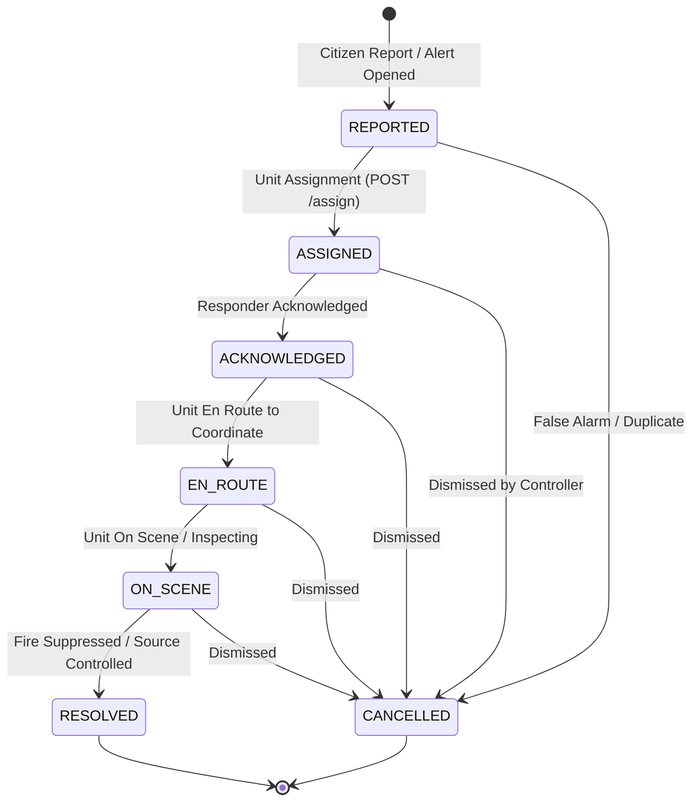

# Fire Department Simulator — Incident Response Console

[](https://flutter.dev/)
[](https://dart.dev/)
[](pubspec.yaml)
[](https://opensource.org/licenses/MIT)

An operational dispatch and response console for municipal authorities, emergency responders, and State Pollution Control Boards (SPCBs). It integrates directly with the **Air Health Incident Engine** to triage public smoke/fire reports, review photo evidence, convert severe air quality spikes into actionable field dispatches, and track unit statuses through an immutable audit trail.

> **Operational Simulation Note**: While this app operates as a simulation interface without dispatching physical emergency sirens, **all status transitions are real, persistent writes** committed to the central PostgreSQL/PostGIS database.

---

## 🏛️ Architecture & Dispatch Lifecycle



---

## 🚀 Key Capabilities

### 1. Incident Triage Queue
- Live polling queue (`GET /api/v1/incidents`) showing active reports across jurisdictions.
- Filter by jurisdiction, priority (Low, Medium, High, Critical), and authority role (`fire_department` or `pollution_control`).
- Real-time in-app alerts whenever new assignments or urgent incidents arrive.

### 2. Evidence Inspection & Ground Truth
- Directly inspects citizen evidence photos attached to reports.
- Links incidents to the initiating source (whether a citizen smoke submission, satellite hotspot candidate, or forward corridor alert).
- Displays exact geographic coordinates, corresponding H3 hexagonal cell index, and temporal timeline.

### 3. Strict State Machine & Idempotency
- Status progression follows strict server-validated transition tables:
  `REPORTED` ➔ `ASSIGNED` ➔ `ACKNOWLEDGED` ➔ `EN ROUTE` ➔ `ON SCENE` ➔ `RESOLVED`.
- All requests are safe from duplicate taps and network drops: action buttons disable during in-flight requests, and the server enforces idempotent status progression.

### 4. Alert Intake for Pollution Control Boards
- Operators with the `pollution_control` role can review published PM2.5 alerts from the latest spatial prediction run.
- Instantiates persistent field inspection incidents directly from severe pollution spikes.

### 5. In-App Diagnostics & Settings
- Comprehensive in-app **Settings Screen** allowing dynamic configuration of:
  - Backend Base URL
  - Simulator API Key (`X-Simulator-Key`)
  - Responder Actor ID (e.g. `fire-unit-7`)
  - Authority Role (`fire_department` vs `pollution_control`)
- Built-in **Test Connection** diagnostic that immediately isolates whether network unreachable errors or server key authentication rejections occur.

---

## ⚙️ Zero-Dependency Architectural Design

The entire application relies strictly on Dart's native standard library (`dart:io` and core Flutter material components) without third-party pub package dependencies:
- **Maximum Reliability**: Zero risk of breaking third-party package updates or version conflicts.
- **Minimal Binary Footprint**: Clean, small release builds without bloated external dependencies.
- **Accurate Transport Handling**: Native socket and HTTP error parsing distinguishes pure network drops from legitimate HTTP 4xx/5xx responses.

---

## 📱 Pre-Built Release APKs

Ready-to-install Android release APKs are located in [`apks/`](../../apks/):

| Target Architecture | File Name | Size | Recommended For |
|---|---|---|---|
| **ARM 64-bit** | [`fire_dept_simulator-arm64.apk`](../../apks/fire_dept_simulator-arm64.apk) | **~19.4 MB** | **Modern Android phones** (recommended) |
| **ARM 32-bit** | [`fire_dept_simulator-arm32.apk`](../../apks/fire_dept_simulator-arm32.apk) | **~16.7 MB** | Older 32-bit Android devices |
| **x86_64** | `app-x86_64-release.apk` | **~20.9 MB** | Android Studio Emulators |
| **Universal** | [`fire_dept_simulator-release.apk`](../../apks/fire_dept_simulator-release.apk) | **~57.5 MB** | Universal fat APK |

### Install via ADB
```bash
adb install apks/fire_dept_simulator-arm64.apk
```

---

## ⚡ Running & Configuration

### Prerequisites
- **Flutter SDK**: `>=3.13.0`
- **Android Studio** / **Android SDK** (API 21+)

### Development Run
```bash
cd partner_apps/fire_dept_simulator
flutter pub get

# Run against default remote backend
flutter run

# Or provide environment configurations via dart-define:
flutter run \
  --dart-define=INCIDENT_API_BASE_URL=http://localhost:8000 \
  --dart-define=SIMULATOR_API_KEY=your-local-secret \
  --dart-define=SIMULATOR_ACTOR_ID=fire-unit-7 \
  --dart-define=SIMULATOR_ROLE=fire_department
```

*Note: For Android Emulators accessing the host machine's localhost, set `INCIDENT_API_BASE_URL=http://10.0.2.2:8000`.*

### Building Production APKs
```bash
flutter build apk --release --split-per-abi --obfuscate --split-debug-info=build/symbols
```

---

## 🧪 Testing

```bash
# Run static analysis
flutter analyze

# Run unit tests
flutter test
```
